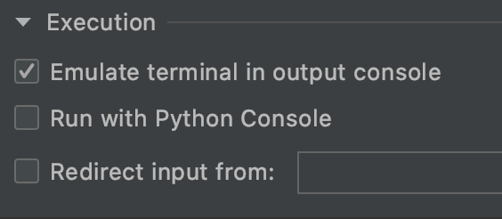

프로그램을 작성하다보면 테스트 데이터가 필요한 경우가 많이 있습니다. 특히나 다른팀과 협업을 해야하는데, 같은 테이블을 사용하는 경우에는 테이블에 뭐라도 들어가 있어야 테스트를 해볼 수가 있는데, 제가 데이터를 만들어 주는 것을 기다리는 팀이 있는 상황에는 일단 수동으로 넣고 테스트 해보시라고 말씀을 드리곤 합니다.

그렇지만, 만들어야 하는 데이터가 열개 스무개가 아니라 몇 백개가 된다면, 그것만으로도 일이 되겠지요. 이런 경우 `프로그램을 사용하여 데이터를 만들수 있다면 좋지 않을까?` 하는 생각에서 파이썬으로 프로그램을 작성하여 보았습니다.

## 테이블 구조

학생의 성적을 관리하는 테이블이 있다고 합시다. 테이블의 스키마는 아래와 같습니다. 테스트용으로 만들어본 것이니 참고만 하시면 좋겠습니다.

이름, 학년, 반, 년도, 학기, 과목, 성적 이렇게 7개의 데이터를 추가해줘야합니다.

| 컬럼명   | 타입          |
| :------- | :------------ |
| uid      | int           |
| name     | varchar\(30\) |
| grade    | int           |
| class_no | int           |
| year     | int           |
| semester | int           |
| subject  | varchar\(30\) |
| score    | int           |

하나의 데이터를 넣으려면 아래와 같은 쿼리가 필요하죠.

```sql
INSERT INTO my_db.student_score
(name, grade, class_no,
 year, semester, subject, score)
VALUES
('승귤', 3, 10,
 1997, 1, '국어', 100);
```

입력해야 하는 데이터가 7종류가 있으니, 10개만 해도 타이핑 해야하는 양이 상당합니다.
이런 데이터를 랜덤하게 넣을 수 있는 프로그램이 있으면 좋겠다는 생각이 마구마구 들죠. 우선 랜덤한 데이터를 사용하기 위해 필요한 것들을 찾아봅시다.

## random 모듈을 사용한 랜덤 데이터 만들기

랜덤한 데이터를 만들기 위해 파이썬에서는 `random` 이라는 모듈을 제공하고 있습니다. random 모듈은 관련된 대부분의 기능을 지원하는데요.

`random`의 함수를 모두 설명하면 그걸로 오늘 분량이 끝날 것이기에 오늘은 딱 두가지 함수만 소개 드리겠습니다.

하나는 일정 숫자범위에서 랜덤한 숫자를 리턴해주는 `random.randrange(start, stop, [Optional])` 함수입니다. 예를들어 2010에서 2020 사이의 숫자를 랜덤하게 나오게 해주려면 아래와 같이 하면 됩니다.

```python
print(random.randrange(2010, 2021))
```

> randrange 함수처럼 start는 포함하고 stop 은 포함하지 않는 형태를 반폐구간이라고 부릅니다. [2010, 2021) 로 표현하기도 합니다.

또 다른 하나의 함수는 `random.choice(리스트)` 인데요. 숫자가 아닌 내가 원하는 리스트를 넣으면 랜덤하게 출력해줍니다.
사실 오늘만들 프로그램에서는 위의 함수보단 다음절에 소개드릴 faker를 사용하긴 했습니다만, 내가 만든 리스트를 랜덤하게 출력할 때 필요하기 때문에 소개드렸습니다.

```python
과목들 = ['국어', '영어', '수학', '과학', '사회', '윤리', '지리', '기술', '체육']
print(random.choice(과목들))
```

## faker를 사용해서 이름 가져오기

입력해야하는 데이터 중에 `이름`이 있는데요. 위에 말씀드린 random.choice 를 사용해도 되지만, 이름들을 만드는 것도 일이 될 수 있습니다. 이런경우에 기본적인 가짜데이터를 만들 수 있도록 도와주는 [faker](https://github.com/joke2k/faker) 를 쓰시면 되는데요. 저는 한글 이름 가져오는 것만 예시로 보여드리고자 합니다.

```python
from faker import Faker
fake = Faker('ko_KR')
print(fake.name())
```

너무 간단하게 한글로된 이름을 가져올 수 있습니다.
이름 외에도, 주소, 색깔, 회사, 신용카드, 직업, 휴대폰번호, user_agent 등의 데이터가 있고 `providers` 를 상속하면 자신만의 랜덤 데이터 셋을 만들 수도 있습니다. 테스트 데이터를 자주 만드시는 편이라면 꼭 한번 살펴보시는 것을 추천합니다.

[faker 문서](https://faker.readthedocs.io/en/master/)

## 테스트 sql 파일 만들기

자 이제, 테스트 파일을 만들기 위한 재료에 대한 설명은 대부분 끝났으니 테스트 데이터를 만들어 봅시다.

```python
import random
from faker import Faker
fake = Faker('ko_KR')
과목들 = ['국어', '영어', '수학', '과학', '사회', '윤리', '지리', '기술', '체육']

def get_test_data():
  이름 = fake.name()
  연도 = random.randrange(2010, 2021)
  학년 = random.randrange(1, 4)
  반 = random.randrange(1, 6)

  for y in range(2):
      학기 = y + 1
      for idx, 과목 in enumerate(과목들):
          점수 = random.randrange(0, 101)
          data = f"('{이름}',{연도}, {학기}, {학년}, {반}, '{과목}', {점수}),"
          print(data)

"""
<결과>
('서지후',2017, 2, 2, 1, '기술', 71),
...
('서지후',2017, 2, 2, 1, '체육', 61),
"""
```

아주 쉽게 테스트 데이터를 만들어 볼 수 있습니다.
다만 위의 함수는 한 사람에 대한 1년 동안의 데이터를 만들어주고 있습니다. 1000명의 데이터를 만들도록 로직을 조금 더 추가해 봅시다.

```python
def create_datas():
  # 1000명의 데이터를 생성한다.
  datas = []
  for x in range(1000):
    one_person_data = get_test_data()
    print(one_person_data)
    datas += one_person_data
```

네 이제 1000명의 데이터를 만들 수 있게 되었습니다.
하지만, 데이터를 화면에 출력만 할뿐인데요. mysql에 바로 넣어주도록 할 수 있으면 좋을 것 같습니다.

sql 파일로 만들 수 있도록 수정 해보겠습니다.

```python
filename = "student_score.sql"

def create_datas():
    f = open(filename, "w") # 쓰기모드로 파일 오픈
    f.write("""INSERT INTO my_db.student_score (name, year, semester, grade, class_no, subject, score)
VALUES
""") # insert 문을 미리 써놓는다.
    datas = []
    for x in range(1000):
        one_person_data = get_test_data()
        datas += one_person_data

    # 마지막에 있는 ,(콤마) 를 ; (세미콜론) 으로 변경하기 위한 코드
    datas[-1] = datas[-1][:-1] + ';'
    for data in datas:
        f.write(data)
    f.close()
```

파이썬의 파일관련 기본모듈을 쓰기모드로 열고 `f.write(문장)` 을 사용하여 한줄씩 넣는 코드입니다. 마지막줄에 있는 콤마만 세미콜론으로 바꾸기위한 코드가 있는것에 주의해주세요. 없으면 mysql에 밀어넣을때 에러가 나게됩니다.

여기까지 하시고 파이썬 프로그램을 실행하시면 같은 디렉토리에 `student_score.sql` 이라는 파일이 생성되어 있을 것입니다.

커맨드 라인에서 아래 명령어를 실행 해주면 데이터를 생성할 수 있습니다. (mysql의 경우입니다.)

```shell
mysql -u <유저> -p < student_score.sql
```

그런데, 이렇게 커맨드를 일일이 실행해주는 것도 귀찮을 수 있습니다. 커맨드를 실행하는 작업도 할 수 있도록 수정해 봅시다.

## mysql에 테스트 데이터 바로 추가하기

파이썬에서 `os.system` 을 사용하면 shell 에서 사용하는 명령어를 사용할 수 있습니다. (mac환경에서 실행해보았습니다.)

아래와 같은 코드가 가능하죠.

```python
os.system(f"mysql -u root -p{mypass} < {dump_file}")
```

추가로 할 일은 덤프파일 경로를 가져오는 것과 패스워드를 입력받도록 하는 것입니다.

### 덤프파일 경로 찾기

덤프파일은 파이썬 파일과 동일한 경로에 있으니 현재 디렉토리의 절대경로를 찾는 함수를 사용하면 됩니다.

```python
current_dir = pathlib.Path().absolute()
dump_file = f"{current_dir}/{filename}"
print("덤프파일 경로 : ", dump_file)
```

`pathlib` 모듈을 사용하면 간단하게 찾을 수 있습니다.
filename은 위에서 미리 정의한 변수입니다.

### 패스워드 입력받기

패스워드는 민감정보이기 때문에 보이면 안되니 사용자에게 입력을 받는 방식으로 해보겠습니다. 입력 또한 패스워드가 노출되면 안되니 리눅스에서처럼 키입력이 보이지 않게 패스워드를 입력하도록 해주는 `getpass` 라는 함수를 사용해보겠습니다.

```python
from getpass import getpass
mypass = getpass("패스워드를 입력해주세요 : ")
```

이 또한 너무 쉽게 할 수 있네요.

> 참고로 pycharm 에서는 패스워드 입력시에 노출이 되는데, `edit configurations` 에서 `Execution -> Emulate terminal in output console` 을 활성화하면 노출이 되지 않습니다.

> 

## 정리하기

테스트 데이터를 만들기 위해서 직접 DB연동을 해서 디비에 바로 데이터를 생성해주는 방법도 있을 것입니다. 하지만 DB연동을 하는 것 자체도 생각보다 많은 노력을 필요로 하고 관련된 함수들을 또한 익혀야 하는 점이 부담이기에 최소한으로 예제를 만드는 것에 집중하였습니다.

만들면서 계속든 생각이지만, 파이썬은 기본라이브러리도 너무 충실하게 되어 있는 점이 아주 매력적인 언어입니다.

최종적인 코드와 테이블의 DDL은 [gist](https://gist.github.com/wapj/256605c28d5650620ffbb1f395dd59fe)에 올려두었으니 혹시나 테스트 데이터를 만드실때 참고하시면 될 것 같습니다.

파이썬 관련해서 궁금한 사항이나 더 알고 싶은 것이 있다면 댓글로 남겨주세요~ 부끄러우신 분은 [트위터](https://twitter.com/wapj2000)에서 DM으로 보내셔도 됩니다. 그럼 오늘도 힘찬 하루 보내세요~
