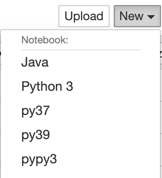

게임을 새로 시작하게 되면 주인공에게 기본 도구 몇 가지를 쥐어주고 시작하게 됩니다.
비록 초반에만 사용하긴 하지만, 게임에 적응할 수 있도록 도와주는 아주 고마운 존재 이지요.

이번 글에서는 파이썬의 좋은 기본도구 몇 가지를 소개하려고 합니다. 반드시 써야하는 것은 아니지만, 사용한다면 거의 매일 사용하게 되는 녀석들이니 혹시나 사용하고 있지 않다면, 이번 기회에 한번 함께 알아보는 것은 어떨까요?

## 패키지 매니저 pip

pip는 파이썬을 설치하면 기본적으로 함께 설치되는 파이썬 패키지 매니저입니다. [파이썬 패키징, 배포 툴의 과거와 현재](https://blog.gyus.me/2020/python-packaging-history/) 라는 글에서 한번 소개한 적이 있지요.

아마도 이 글을 보시는 분들은 모두 사용하시고 있을거라고 생각이 됩니다. 그만큼 가장 기본이 되는 툴이고 기본 라이브러리에 포함되어 있기도 합니다.

pip는 생각보다 많은 기능을 제공하고 있는데요. 이번글은 소개글이니 제가 사용하는 기능 한 가지만 소개하려고 합니다.

바로 `pip freeze` 라는 기능입니다. 해당 명령어를 사용해서 해당 파이썬 환경에 설치된 라이브러리들을 모두 확인 할 수 있습니다.
그리고 아래의 명령을 사용해서 `requirements.txt` 파일을 바로 만들어 낼 수 있죠.

```
pip freeze > requirements.txt
```

제가 사용하는 pip의 다른 기능 두 가지는 다음 기회에 또 소개 드리겠습니다.

## 파이썬 스러운 테스팅을 위한 pytest

패키지 매니저는 표준 라이브러리를 소개해 놓고, 테스팅에서는 unitest가 아닌 pytest 를 소개하는지 궁금하실 겁니다.

unittest는 자바의 junit과 너무나 비슷한 인터페이스를 제공해서 기본적으로 작성해야 되는 코드들이 있습니다.

아래와 같이 테스트를 위해서는 unittest.TestCase를 상속받은 클래스를 만들어야하죠.

```python
class MyTest(unitteest.TestCase):
    def test_my(self):
        print(" 1 + 1 은 귀요미")
        reutnr 1 + 1
```

반면 pytest 는 바로 함수만 작성하면 됩니다. 보기만 해도 깔끔하죠?

```python
def test_my():
    print("1 + 1 은 2 ")
    return 1 + 1
```

만약에 테스트 전/후로 실행해야 하는 것이 있다면 unittest에서는 `setup()` 과 `teardown()` 이라는 뭔가 자바스러운 녀석을 사용해서 전/후 처리를 하게 됩니다. 아래와 같은 형태의 코드가 되겠죠.

```python
class MyTest(unitteest.TestCase):
    def setUp(self):
        print("테스트 데이터 생성")
        return

    def tearDown(self):
        print("테스트 데이터 삭제")
        return

    def test_my(self):
        print(" 1 + 1 은 귀요미")
        return 1 + 1
```

그렇다면 pytest는 어떻게 할까요?

pytest 에서는 `데커레이터`와 `제너레이터` 를 사용하게 됩니다.

뭔가 어려워 보이는 말이 두 개가 동시에 나왔는데요. 예제로 살펴보겠습니다.

```python
@pytest.fixture()
def resource():
    print("테스트 데이터 생성")
    yield
    print("테스트 데이터 삭제")

def test_my(resource):
    print("1 + 1 은 2 ")
    return 1 + 1
```

`@pytest.fixture` 가 데커레이터이고, fixture가 붙은 녀석의 함수를 `test_my` 에 주입을 시켜주게 됩니다. 그러면 테스트 함수 전후의 처리를 하게 되는데. 함수의 전후 처리를 yield 를 기준으로 작성할 수 있습니다.

단순한 예제 2가지 입니다만, 이 정도만 봐도 pytest가 파이썬스러운 코드라는 것은 확실히 맞는 것 같습니다.

간결함을 지향하는 파이썬스러운 테스트 모두함께 만들어 갑시다.

## 타협하지 않는 코드 포매터 black

[블랙](https://movie.daum.net/moviedb/main?movieId=48491) 이라는 감동적인 영화가 있습니다.

그 영화에는 "알파벳은 원래 ABCDE로 시작되지만, 너에겐 B로 시작한다. b l a c k..." 라는 명대사가 있습니다. 그 영화의 주인공에게 보이는 세상은 온통 검정색이기 때문이죠.

코딩 스타일에 색이 있다면 100이면 100 모두 다른색이지 않을까요?
홀로 코딩을 하게 되는 경우에는 이러한 개인적 성향과 취향이 전혀 관계가 없고 코딩 스타일에 신경을 쓰지 않아도 되니 생산성 향상에 도움이 될 수도 있을 것 같습니다.

하지만, 팀으로 일한다면 문제가 달라지는데요.
이런 것을 해결하기 위해 나온 것이 `팀의 코딩 스타일은 한가지 색이어야 한다` 라는 철학을 가진 `타협하지 않는 코드 포매터` 가 [black](https://github.com/psf/black) 입니다.

black의 사용법은 굉장히 쉽습니다.

```
pip install black
black {디렉토리}
```

체크만 하려면 `--check` 를 붙여주면 됩니다.

```
black --check main.py
```

개인적으로는 사용하시는 에디터나 githook 에 넣어서 자동으로 포매팅 하시길 추천드립니다. 이미 수많은 성공적인 파이썬 프로젝트에 사용하고 있으며 저는 pycharm에서 저장시 마다 자동 실행 되도록 해두었습니다.

코드 리뷰시에 코딩 스타일에 의한 논쟁은 `black` 을 도입하는 순간 끝나게 됩니다. black에서 포매팅 해주는 것이 마음에 들지 않을 수 있는데, 그것도 익숙해지면 편안해집니다. 꼭꼭 사용하시길 강추합니다.

## 파이썬 환경 관리툴 pyenv, virtualenv

> 안타깝게도 윈도우에서는 pyenv 를 제대로 지원하지 않습니다. ㅠㅠ

- 혹시 파이썬 버전업 하실때 공식 홈에서 받아서 업그레이드 하시거나 지우고 다시 설치하고 계신가요?
- 여러개의 파이썬 버전을 사용하고 싶으신가요?
- 프로젝트 A에서는 장고를 사용하고 프로젝트 B에서는 플라스크를 사용중인데 패키지가 충돌이 나고 있나요?

네 이런 부분에 대한 고민을 하고 계신 다면 pyenv, virtualenv(venv) 가 좋은 해결책입니다.

설치시에는 [pyenv-installer](https://github.com/pyenv/pyenv-installer) 를 사용하시면 아주 깔끔하게 설치가 됩니다.

```bash
curl https://pyenv.run | bash
```

.bashrc 같은 설정파일에

```
export PATH="$HOME/.pyenv/bin:$PATH"
eval "$(pyenv init -)"
eval "$(pyenv virtualenv-init -)"
```

도 넣어 두시고 쉘을 껏다가 켜시면 됩니다.

### 여러 버전의 파이썬 설치하기

pyenv 의 install 서브 커맨드를 사용하면 됩니다.

```
pyenv install {파이썬 버전}
```

어떤 버전이 있는지 모르시는 경우에는 --list 를 넣으시면 리스트가 많이 나오게 됩니다. 2020년 11월 1일 기준으로 python3.9.0 도 있네요~

```
pyenv install --list
```

아래 명령어로 설치를 하게 되면, ~/.pyenv 라는 디렉토리에 파이썬이 버전별로 설치되게 됩니다. 여러개의 버전을 동시에 바꿔가며 사용해 볼 수 있습니다.

```
pyenv install 3.9.0
```

특정 파이썬 버전을 사용하려면 pyenv shell 명령어를 사용하면 됩니다.

```
pyenv shell 3.9.0
```

> pyenv 로 python 설치시 빌드가 실패하는 경우가 있습니다. 그경우에는 https://github.com/pyenv/pyenv/wiki/Common-build-problems 에서 찾아보시면 대부분의 문제를 해결 할 수 있습니다.

### pyenv virtualenv 로 가상환경 만들기

패키지만 따로 저장할 수 있도록 가상환경을 만들 수 있는데요.
명령어는 아래와 같습니다.

`pyenv virtualenv {설치된 파이썬 버전} {가상환경 이름 }`

```
pyenv virtualenv 3.9.0 py39
```

가상환경을 사용하기 위해서는 아래와 같이 pyenv activate 라는 명령어를 사용하면 됩니다.

```
pyenv activate py39
```

가상환경에서 나가기 위해서는 pyenv deactivate 를 사용하면 됩니다.

```
pyenv deactivate
```

> 이런 명령어들을 일일이 입력하는게 귀찮으신 분은 [autoenv](https://github.com/inishchith/autoenv) 를 사용해보시길 바랍니다.

### pyenv 업데이트하기

제 경험상 pyenv 는 git 으로 업데이트하는 것이 가장 깔끔했습니다. pyenv-installer 로 설치해도 git으로 설치됩니다.

```
cd ~/.pyenv
git pull
```

지금까지 pyenv 의 소개와 간단한 사용법에 대해서 알아 보았습니다. 혹시 사용하고 있지 않다면 이 또한 꼭 사용해보시길 추천드립니다!

## 인터렉티브한 REPL : jupyter notebook

마지막으로 소개드릴 도구는 jupyter 입니다. 저는 ipython-notebook 으로 먼저 알게된 프로젝트인데요. ipython 시절에는 python 만 지원하다가 jupyter로 변경되면서 다양한 언어를 제공하기 시작했습니다.

jupyter notebook 은 웹브라우저에서 코드를 실행하고 그 실행 결과를 바로 확인 할 수 있는 도구입니다. 파이썬 뿐만 아니라 자바, 스칼라, 코틀린, 루비등 수많은 언어들을 제공합니다. [jupyter kernels](https://github.com/jupyter/jupyter/wiki/Jupyter-kernels) 에서 지원하는 언어들을 확인하실 수 있습니다.

jupyter 를 사용하지 않으시더라도 python 쉘대신 `ipython` 을 사용해보시면 훨씬 더 편한 REPL 환경을 접하실 수 있을 것 입니다. 참고로 ipython 은 주피터를 설치하게 되면 자동으로 설치가 됩니다.

설치는 아래와 같이 합니다.

```
$ pip install jupyter
```

그리고 실행은 원하는 디렉토리로 이동 후

```
$ jupyter notebook
```

을 입력해주시면 브라우저가 뜨게되고(보통은 localhost:8888 입니다) 거기서 파이썬 코드를 실행해볼 수 있습니다.

쥬피터 노트북을 활용하여 만든것이 바로 [구글 colab](https://colab.research.google.com/notebooks/) 프로젝트인데요. 설치가 귀찮으신 분은 해당 웹사이트에서 바로 사용해 보실 수 있을 것 같습니다.

### jupyter kernel 추가

쥬피터 노트북에는 커널이라는 개념이 있는데, 다양한 프로그래밍 언어를 지원하기 위한 기능입니다.

아래 이미지에는 제가 사용하는 커널들의 리스트가 나와 있습니다.



저런 커널들이 설치가 되지 않으면 동작을 하지 않을 때가 있는데요. 파이썬 3.9.0 을 설치하고 가상환경인 py39를 추가했지만 주피터에서 사용할 수 없다면 커널을 추가해주어야합니다.

커널을 추가하기 위해서는 `pip install ipykernel`로 ipykernel 이라는 패키지를 설치해야합니다.

그리고 아래 명령어를 입력해서 추가를 한다음 주피터 노트북을 재시작 하면됩니다.

```
python -m ipykernel install --user --name py39 --display-name "py39"
```

## 마무리

이상으로 개인적으로는 가장 많이 사용하는 기본도구들 5가지를 소개해 드렸습니다. 파이썬을 좋아하시고 많이 사용하시지만, 아직까지 사용해본 적이 없는 도구들이 있다면 이번기회에 알아보시는 것은 어떨까요?

궁금하신 점은 댓글로 남겨주세요~ 감사합니다.

### 참고 링크들

- https://books.agiliq.com/projects/essential-python-tools/en/latest/

- https://docs.python.org/3/library/unittest.html

- https://black.readthedocs.io/en/stable/
