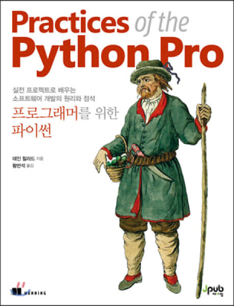

책의 한국어 제목이 좀 긴데, `실전 프로젝트로 배우는 소프트웨어 개발의 원리와 정석, 프로그래머를 위한 파이썬`이다. 제목이 좀 길다면 긴데, 저자가 하고자 했던 말들이 많았던 것 같다. 영어로는 Practice of the python pro로 `파이썬 실전연습` 쯤 되는 제목인 것 같다.

제목처럼 이 책은 파이썬으로 `프로젝트를 어떻게 개발할까?` 에 초점을 맞춰서 책이 진행된다. 설계는 어떻게 하는지, 클래스는 어떻게 쪼갤지, 프로젝트에 패키지는 어떻게 배치를 하면 좋을지, 테스트, 성능, 확장성, 경량화 등 파이썬으로 개발할 때 생각해봐야 하는 문제들을 한번 독자로 하여금 생각을 하게 해 주고 있다.

이 책의 장점이라면 간단한 북마크 프로젝트를 만들면서 프로젝트의 설계에 대해서 생각을 할 수 있도록 유도한다는 점이다. 작은 프로젝트를 조금씩 발전시켜가면서 설계를 간접적으로 해보는 것은 좋은 결정이었다고 생각된다. 중간 중간에 교양 수준의 프로그래밍 지식이 나오게 되는데, 이 부분은 꽤나 흥미로운 내용이 많았다.

단점이라면 너무 많은 부분을 저자가 짧은 지면에 설명하려고 했기 때문에, 많은 부분들이 생략되어 있다는 것이다. 그래서 대부분은 다른 책에 있는 내용의 요약이 나오게 된다. 또한 개발자를 대상으로 쓴 책인 것 같은데, 기초적인 내용의 예제들이 대부분이라는 부분은 아쉽다.

개인적으로는 11장 향상과 진보가 가장 좋았다고 생각이 드는데, 아는 것과 모르는 것을 잘 파악하는 것은 평소에도 중요하다고 생각하고 있었지만, 책에서는 이 부분을 좀 더 잘 풀어서 설명을해주고 있다. 만약에 이 책을 구입하는 사람이 있다면 11장은 꼭 보시길 추천한다.

`어떤 사람이 보면 좋을까?` 파이썬 입문서적을 막 끝낸 시점의 개발자라면 괜찮을 것 같다. 혼자서는 방황하기 쉬운 파이썬의 바다에서 약간의 길잡이가 되어 줄 수 있을 것이다. 다만 방향만 알려줄 뿐이니 길을 가는 것은 스스로 해야 한다는 점은 꼭 인지하고 있어야 한다.

> 제이펍 서평 이벤트로 쓴 글임을 밝혀드립니다.
