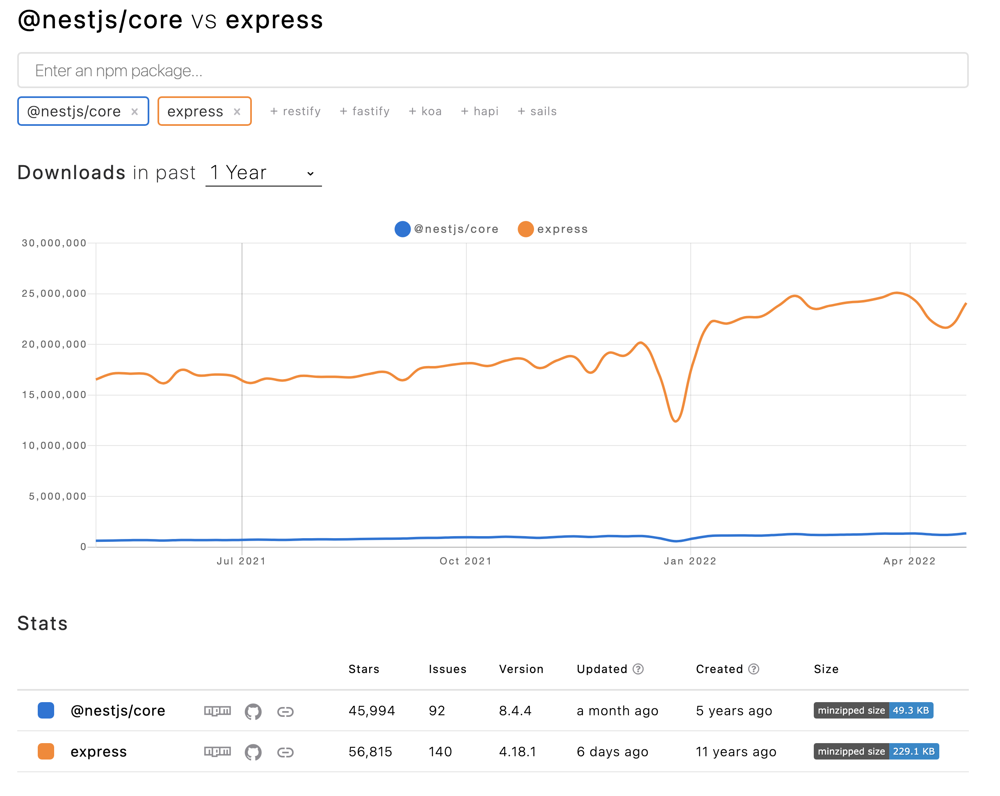
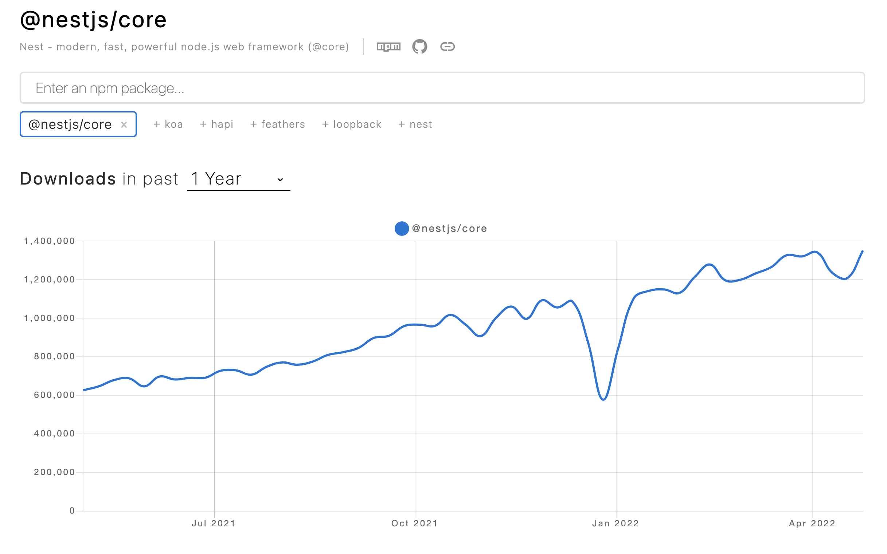

## 개요

- NestJS(이하 Nest)는 Node.js에서 돌아가는 서버 사이드 어플리케이션이다. 
- 타입스크립트를 완벽 지원한다. 
- 진보적인(progressive) 자바스크립트를 사용한다. 
    - 진보적인게 무슨뜻인가? 
    - [스택오버플로우](https://stackoverflow.com/questions/67205590/why-nest-js-claims-to-be-progressive#:~:text=According%20to%20a%20Dictionary%20on,js%20world.%22)의 링크에 보면 나와 있지만, 최신 자바스크립트의 기능을 사용한다는 뜻으로 추측한다.

- Express를 기본적으로 사용하며 선택적으로 Fastify를 사용할 수 있다. 
- Express와 Fastify에 추상화 수준을 제공하지만, 개발자가 직접 API를 호출 할 수있다. 그러므로 서드파티 모듈도 자유롭게 사용할 수 있다. 


## 철학 

- 자바스크립트는 백엔드와 프론트엔드 모두에서 공용 언어로 사용할 수 있게 되었고 프론트엔드에서는 앵귤러, 리액트, 뷰등의 매우 뛰어난 프로젝트들이 나왔다. 서버 측에도 뛰어난 라이브러리들이 많이 있으나 아키텍쳐 문제를 효과적으로 해결하지는 못했다. 
- Nest는 테스트가능하고, 확장가능하며, 느슨하게 결합 하고, 쉽게 유지보수할 수있는 어플리케이션을 제공한다. 아키텍쳐는 앵귤러의 영향을 많이 받음. 


## 설치하기 

3가지 방법이 있음   


### nest cli로 설치 

기본값으로 타입스트립트 스타터를 설치함 


```bash
$ npm i -g @nestjs/cli
$ nest new {프로젝트명}
```


자바스크립트를 사용하고 싶으면 다음과 같이하자 

```bash
$ nest new -l Javascript {프로젝트명}
```


실행하면 패키지 매니저 뭐쓸지 물어봄. npm, yarn, pnpm 중에 물어보는데 원하는거 사용하시길


### git clone 해서 설치 

어째 보면 명확한듯 

```bash
$ git clone https://github.com/nestjs/typescript-starter.git project
$ cd project
$ npm install
$ npm run start
```


자바스크립트 쓰고 싶으면 요걸쓰면 된다. 

```
https://github.com/nestjs/javascript-starter
```


### 밑바닥부터 만들기 

cli로 프로젝트를 만들면 필요없는 녀석들이 덕지덕지 붙는다. 깔끔한 설정을 원하는 사람은 다음과 같이하면 된다. 


```bash
$ npm i --save @nestjs/core @nestjs/common rxjs reflect-metadata
```


개인적으로는 밑바닥 부터 만드는 것을 좋아한다. 


## 실행하기 

nest 명령으로 실행한 경우 

```bash
$ npm run start
```


혹은 

```bash
$ npm run start:dev
```


를 사용할 수 있다. 


start:dev의 경우는 nodemon을 사용해서 파일이 변경될 때 마다 리프레시 해준다. 


실행후 확인은 localhost:3000 에서 확인할 수 있다. 

대충 이런거 나옴 

  


## NestJS는 쓸만할까?

NestJS의 목표는 어플리케이션을 제작할 때 필연적으로 생기는 모듈간의 의존성을 느슨하게 관리함으로써, 작은 프로젝트가 아닌 큰프로젝트에서도 잘 동작하는 웹서비스를 만드는 것이다. 이를 위해서 DI를 제공한다. 타입이 없는 언어의 경우 프로젝트가 커지게 되면, 소스를 수정할 때 대참사가 일어날 수 있는데, 이를 방지하기 위해서 타입스크립트를 완벽지원한다. DI를 사용함으로써 테스트도 쉽게 할 수 있고 코드간의 의존성도 느슨하게 관리 할 수 있다. express를 기본 엔진으로 쓰면서, 성능이 필요한 곳에는 fastify를 쓸 수 있는 것도 DI덕택이다. 내 생각으로는 혼자 만드는 간단한 프로젝트는 express를 계속 많이 사용하겠지만, 팀으로 작업하는 곳에서는 Nest를 도입하고자 하는 곳이 많아질 것으로 예상된다. 나도 팀으로 작업을 한다면 express가 아니라 타입스크립트 완벽호환에 아키텍쳐를 안정적이고도 유연하게 가져갈 수 있는 NestJS를 선택할 것 같다. 

   

npm trends에서 살펴보면 다운로드수는 express가 압도적으로 많다. 다만 nestjs를 다운로드하면 의존성 패키지에 express가 있으므로 다운로드 수로 앞지르는 일은 앞으로도 없을 것이다. 


  


다만 nestjs 단독으로만 보면 꾸준하게 사용이 늘어나는 것을 볼 수 있다. 

  


### 추가로 읽어보면 좋은 글 

[https://betterprogramming.pub/clean-node-js-architecture-with-nestjs-and-typescript-34b9398d790f](https://betterprogramming.pub/clean-node-js-architecture-with-nestjs-and-typescript-34b9398d790f)
