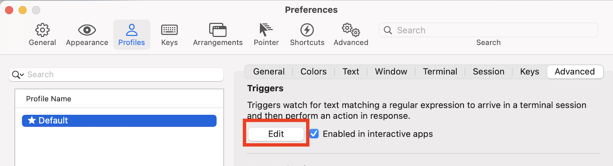
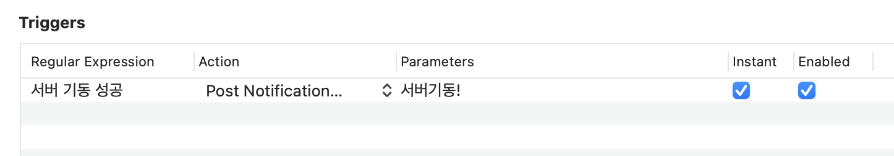

## 개요

스프링 서버는 보통 기동시 30초 이상 걸리는 경우가 굉장히 많다. 그래서 서버를 재시작 할때마다 30초씩 넋을 놓고 기다리는 경우가 많이 있는데, 기다리지 않고 스크립트로 감시를 걸어둔 다음 알림으로 받을 수 있으면 좋을 것 같다. 하나씩 해보도록 하자.

### 기동시 확인할 API

스프링 부트 서버가 기동 되었는지 확인하는 API는 다음과 같다고 가정한다.

```
<서버URL>test/info
```

스프링이라면 요런 식으로 만들 수 있다.

```java
@RestController
@RequestMapping("test")
@Slf4j
public class ApiTestController {
    @Autowired
    private BuildProperties buildProperties;

    @GetMapping("/info")
    public String extInfo() {
        log.debug(buildProperties.getName() + ' ' + buildProperties.getVersion());
        return buildProperties.getName() + ' ' + buildProperties.getVersion();
    }
}
```


호출시 아래와 같은 정보를 문자열로 반환해 준다.

```
api version : {버전정보}
```

성공하면 api version 이 찍히는 것을 알았으니 특정 문자열이 터미널에 찍히는 것으로 알림을 받을 수 있다. iterm2에서는 트리거라는 기능으로 해당 기능을 제공하고 있다.


## 서버를 계속 호출하는 쉘 스크립트 만들기

특정 문자열이 들어오는지를 체크 후 iterm2 트리거로 등록 하여 알림을 받을 수 있다.
마찬가지로 다른 서버에서도 비슷한 API를 만들어서 똑같이 알림을 받을 수 있도록 처리할 수 있을 것이다.

아래와 같은 쉘 스크립트를 만들어보자.
while true가 있어서 3초마다 한번씩 무한으로 계속 실행된다.

```bash
#!/bin/bash

 SERVER="${1:-api}"
 echo "$SERVER"
 SERVER_URL="http://localhost:9090/test/info"

while true; do
    STATUS=`curl -s -o /dev/null -I -w "%{http_code}"  $SERVER_URL`

    if [ "$STATUS" = "200" ]; then
        echo "서버 기동 성공!"
        break
    fi

    sleep 3
done

 ```

여기서 성공시 서버 기동 성공!  을 줄 것이다.
특정 문자열을 iterm2의 트리거로 등록하여 알림을 받아보자.

## iterm2에 트리거로 등록하기

iterm2에는 아래와 같이 설정한다.

Profiles → Advanced → Triggers → Edit → Triggers → + 버튼 눌러 추가

→ Regular Expression : 서버 기동 성공.* , Action : Post Notification, Parameters : 노티시의 메세지, Instant : 체크, Enabled : 체크







만들어둔 스크립트를 서버가 뜨는동안 실행 해두면 서버가 완전히 뜰때까지 감시를 하고 끝나면 알람을 주고 스트립트가 종료된다.

이제 서버 뜨는동안 잠깐 딴짓을 할 수 있다!
