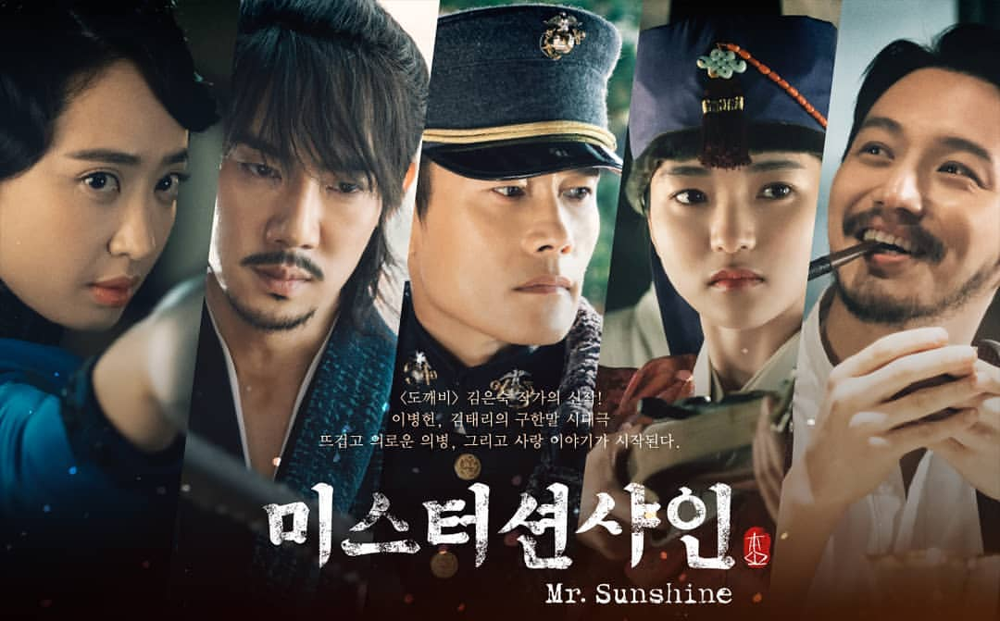

> 넷플릭스를 결제했다.

사실 회사에서 카카오 페이지 캐시를 한달에 5만원씩 주기 때문에 개인적으로는
넷플릭스를 쓸 이유가 전혀 없었는데, 장모님께서 응답하라 1988이 보고싶으시다고 하셔서
구독을 하게 됐다. 이때까지만 해도 나는 넷플릭스 별로 안볼거라고 생각했다.

## 미스터 션샤인을 보다

넷플릭스 결제와 함께 시작한 `미스터 션샤인`.
개인적으로는 한국 드라마의 기승전 사랑 이라는 뻔한 스토리가 싫어서 잘 안보는 편인데,
미스터 션샤인은 3명의 남자가 의병을 하는 한 여자를 위해 인생을 거는 내용임에도 불구하고 너무나 재미있게 봤다. 아마도 연애를 하는 장면보다는 시대적 상황 때문에 인내하는 모습이 너무나 안타까웠기 때문일것 같다. 24편까지 있는 매우 긴 호흡의 드라마였으나, 배우들의 연기도 너무 좋고 스토리도 좋고 감명깊었다. 일본어는 서울말씨 들어간 일본어가 주로 들려서 약간 일본어를 할 줄아는 입장에서는 약간 집중을 흐트리기는 했으나 그마저도 굉장히 노력한 것이 보여서 훌륭했다.

가장 좋아하는 한국드라마가 뭐요? 라고 묻는 질문에 이제 답할 준비가 된 것 같다.

## 화제의 오징어게임

배틀로얄, 카이지, 라이어게임 같은 게임을 통해 살아남는 류의 스토리의 드라마이다. 여러가지로 연출이 훌륭했고 보는 재미가 있었다. 주인공이 시련을 당하면서도 죽지는 않을 것을 알고 봐서 그런지 스토리는 크게 재미가 없긴했다. 카이지나 라이어게임 같은 경우는 승리를 하기위한 과정들이 굉장히 치밀하고 위기의 위기의 위기에서 빠져나오는 장면이 재밌었는데, 오징어게임은 그런 재미는 없고 좀 단순한 편이었다. 한국식 라이어게임 같은 느낌인데 개인적으로는 더 재미없었다.

이건 내가 이쪽 장르에 익숙해서 그런것이니 카이지나 라이어게임 안본사람은 보면 재미있을 것이다.

## 섬광의 하사웨이

건담은 카카페나 넷플릭스에서 찾기가 좀 힘든데, 넷플릭스에 건담 신작이 있어서 봤다. 정말 후반부까지 이게 무슨내용이지? 라는 생각이 많이 들었다. (좀 찾아보니 건담의 스토리를 이해하고 있어야 한다고 한다. 나도 100%는 아니라도 이해하고 있는데... 얼마나 더..?)

건담하면 전투장면이 좀 나와줘야 되는데, 전투장면이 적다. 그래도 몇 안되는 전투장면은 매우 멋지다. 작은 화면으로 봐서 아쉬움.

섬광의 하사웨이는 2편, 3편이 더 재미있을 것 같다. 건담을 잘 모른다면 패스하시길

## D.P

사실 나는 군대를 가지 못했기 때문에, 크게 재미는 없을 것이라는 생각이 있었는데, 굉장히 속도감이 있고 말로만 들었던 가혹행위를 간접체험 할 수 있었다. 요즘에는 때리지는 않고 욕을 한다고 한다. 그마저도 자유시간에 고참들이 게임을 해야해서 괴롭히는 시간이 많이 줄었들었다고 한다.

보고 나서 좀 여운이 남는 그런 드라마였다. 예전에 기사로 봤던 윤일병 가해사건 등이 생각나는 드라마였다. 원작이 웹툰이라고 하는데 한번 찾아봐야겠다는 생각이 들었다.

## 추석 연휴에 정말 많이 봤네

`미스터 션샤인`은 추석전부터 보고 있었긴 했지만, 마지막편을 추석연휴에 다봤고, 나머지도 틈틈히 봤더니 어느새 4편을 모두 다봤다... 이제 좀 천천히 봐도 될 것 같다. 너무 오랜만에 몰아서 좋은 작품들을 많이 봤다. 이제 당분간은 좀 줄여야겠다.

P.S 넷플릭스 추천작 알려주세요~
