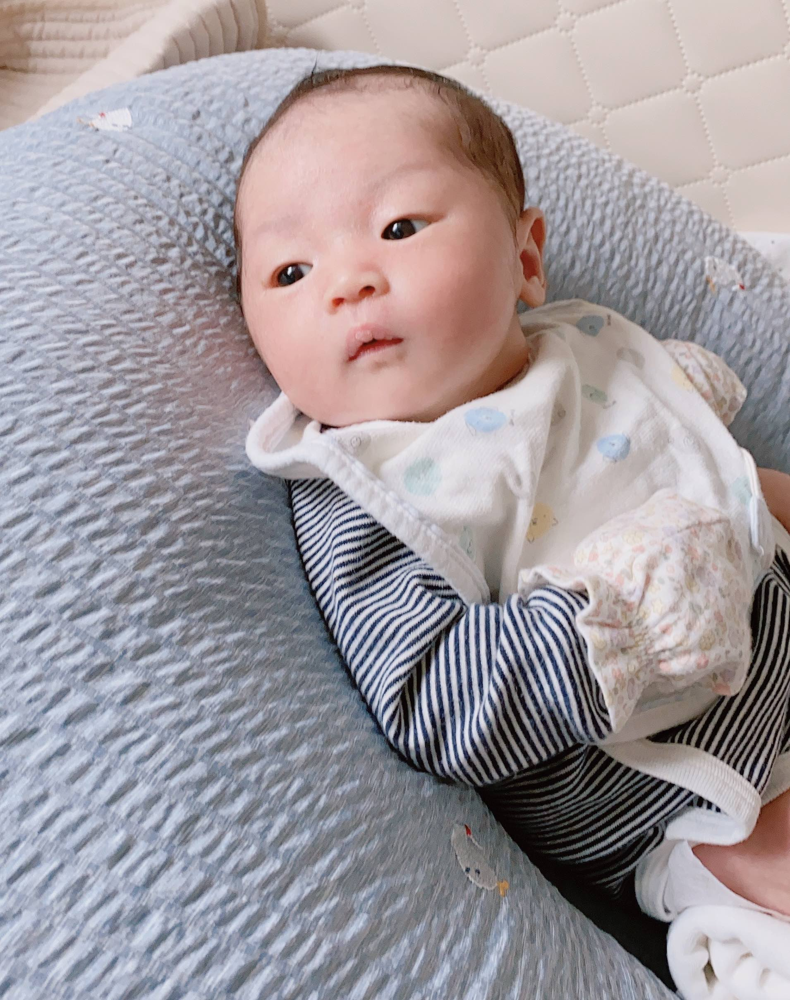

> 인생은 실전이다.

## 조리원 퇴소, 병원 정기 검진

누가 말한건지 모르겠지만, 정말 맞는말이다. 인생은 실전이다.
조리원에서의 3주간 긴 튜토리얼을 마치고, 바로 병원으로 향했다.

뭔가 문제가 있어서는 아니고 아기에게 BCG 접종을 하고 엄마는 정기 검진을 하기 위해서였다. 엄마의 정기검진이 11시였는데, 혹시나해서 10시에 병원을 갔다.

그건 참 잘한 것 이었는데, 소아과에서 아기에게 예방접종을 한다음... 아기가 진짜 너무 심하게 울었기 때문이다. 소아과 선생님왈 '이건 안아픈 주사예요' 라고 했는데, 거짓말 진짜 거짓말... 다른 아기는 막 토하고 난리도 아니었다.

거기에 기저귀도 갈아야하고 배고픔까지 동시에 와서 우리아기가 그렇게 심하게 우는 것을 처음봤다. 나와 아내는 매우 당황했는데, 아내는 검진을 받아야해서 올라가고 나는 차에서 아기를 달래면서 준비해온 모유를 젖병에 담아서 주었다. 조리원 퇴소부터 정말 쉽지 않다는 생각이 든다.

## 애기밥은 챙기는데 내 밥은 언제 챙겨?

아내는 모유가 많은 편이라 길때는 4시간 짧을때는 3시간에 한번 모유를 유축해놓는다. 그런데 이게 말이 쉽지... 24시간을 3으로나누면 하루에 8번이고 4로 나누면 6번이다. 자다가도 시간되면 일어나서 모유를 유축해야한다. 아기는 신생아라서 짧을 때는 2시간 반, 3시간 길때는 4시간마다 맘마를 주어야한다.

가장 베트스 케이스가 20분만에 맘마를 다먹고, 15분동안 토닥거리면서 트림을 하고, 그뒤에 혼자 노는것인데... 애기는 쉬도 1시간에 한번씩 한다. 그리고 맘마먹다가 배가아파서 중간에 트림을 시켜줘야하기도하고... 응가도 한번씩 한다. 그러면 엄마 아빠 둘중에 한명은 애기를 보고 있어야하는 상황이다. 어떤 경우는 둘이 동시에 해야하기도하고...
이런 상황이 되면, 엄마 아빠 밥은 챙기기가 참 쉽지 않다. 점점 대충 먹고, 대충씻고 대충 입고 대충 자게 된다...

## 도움! 장모님의 상경

부산에 살고 계시는 장모님이 도와주러 상경하셨다. 그냥 오셔도 될 것을 한우 20만원어치와 된장, 갈비탕도 같이 가져 오셧다. 우리집 냉장고가 내가 혼자 살 때 쓰던 녀석이라 용량이 턱없이 부족한게 문제였지만...!

애기 돌보는 것을 도와주러 오신 장모님은 오셔서 냉장고 털이를 하시고 사위와 딸의 밥을 챙겨주시고 가셨다. 그것만해도 너무 감사하다. 엄마 아빠가 아기를 돌 볼때 누군가 엄마아빠를 챙겨주면 육아도 할 만할 것 같다.

## 실전 육아 101

육아는 정말 실전이다. 유튜브도 보고, 책도 보고, 조언도 많이 듣지만, 결국에는 아이마다 다르고 부모마다 달라서 다르게 키우게 된다. 그나마 우리 아이는 낮에는 칭얼 거리다가도 밤에는 매우 숙면을 취하는 편이다. (그래서 글도 지금 애기를 재우고 난 새벽에 쓰고 있다.) 아직까지는 체력이 있어서 글을 쓸 수가 있는데, 다음주에도 별일 없이 아이를 키우는 이야기를 쓸 수 있으면 좋겠다. 오늘도 우리 아기 사진을 한장 투척하며 마친다. 좋은 하루 보내시길!

