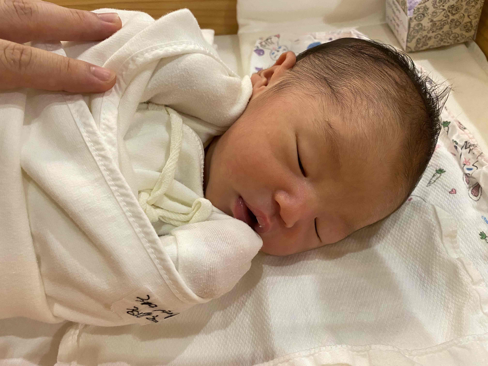

## 자본주의를 알게 해준 산후조리원

산후조리원에 들어온지 이제 3주차이다. 산후조리원은 내가 자본주의 사회를 살고 있구나를 정말로 잘 알수 있게 해주는 장소였다. 평소에 백만원이 넘는 돈을 쓸일이 거의 없는데, 산후조리원은 시설과 위치, 서비스에 따라 들어가는 액수가 정말로 천차만별이었다. 아내가 그래도 집가까운 곳중에 괜찮은 곳을 열심히 검색해서 집근처의 산후조리원으로 가게 되었는데, 돈을 많이 쓰면 편하고 좋구나를 잘 깨달을 수 있었다.

## 육아 튜토리얼

게임 같은 경우는 튜토리얼 정도는 무료로 체험할 수 있는데, 인생은 실전이기 때문에 튜토리얼도 돈내고 들어야 하는데, 아마 처음부터 아무것도 모르는 상태로 아기를 봤다면 엄마와 아빠는 극심한 스트레스에 빠질것이다. 그래도 산후조리원이 있어서 다행이다 생각했다. 모자동실이라고 해서 아기를 돌 보는 시간을 최소한으로 할 수 있는데, 오전 7시~9시, 오후 6시30분~8시30분 이 시간만 의무적으로 아이를 돌보면 된다. 그 사이에 엄마는 몸도 추스리고 마사지도 받고 할 수 있는 것이었다.
모자동실 시간에 아이를 보면서 조금씩 스킬이 늘어간다. 기본적으로 맘마주기. 안아주기. 등토닥거리면서 트림시키기. 속싸게 싸기. 기저귀갈기. 등등이 있겠다. 엄마들은 좀 더 다양한 스킬을 배우는 것 같은데, 나는 듣지 못했다. ^^;

## 조리원인데 벌써 피곤하다.

산후조리원이라고 해서 나는 편할줄 알았는데 아니었다. 최소한으로 아기를 돌보는 것인데도 엄청 피곤했다. 기본적으로 매일 아침 6시30분에서 7시 사이에 아기를 데려가라는 전화가 온다. 그리고 아기를 보느라 정신없는 시간이 8시 30분에 아침이 오고 10시 30분에 간식이온다. 9시시 정도에 아기를 신생아실에 데려다주고나면 마사지 실에서 예약전화가 계속온다. 그리고 나서 1시간 정도 쉬면 다시 점심시간이다. 점심먹고 아내는 마사지를 받으러간다. 조금있다가 또 간식타임이고, 청소하러 오시는 분이 오고, 빨래를 가져다 주시는 분들이 온다.

매우 스트레스 받는 것은... 그냥 밥이나 간식 빨래 같은것은 밖에 놔둬 주시면 좋겠는데, 노크 하시면서 꼭 안에 놔두신다. 편하게 누워있을 수가 없다.

그래서 그런지 조리원에 있는 3주동안 스트레스 받으면 생기는 증상들이 몸에 나타나고 있다. 빨리 집에가서 쉬고 싶은데, 집에가면 아기를 보느라 힘들겠지...ㅠㅠ

> 육아는 튜토리얼 부터 어렵구나...

마지막으로 우리 아가 사진을 투척~! 오늘도 좋은 하루 되시길~

