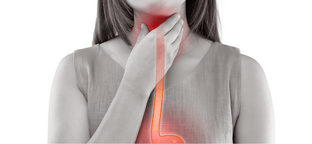

## 목에 무언가 걸린 느낌?!

지금 두달정도 커피를 거의 안마시고 있다. 왜냐하면 목에 무언가 걸린 느낌 때문이다. 목에 이물감이 있다는 표현을 쓰는데, 정말로 하루종일 목에 뭔가 걸린 느낌이고, 뭔가 먹고 있을 때만 괜찮아져서 계속 먹을 것을 찾게 된다.

## 결국 병원행

한달정도는 그냥 커피만 안마시고 지냈는데, 커피를 안마시면 원래 괜찮았었는데, 괜찮을즈음에 커피를 진짜 딱 1잔 마시면 다시 증상이 돌아와서 굉장히 불편했다.

아내에게 얘기했더니 찾아보고 양배추즙을 사줘서 양배추즙을 1달먹었더니 또 괜찮아졌다. 그런데... 이것도 잠시 몸상태가 안좋으니 또 증상이 도지는 것이다.

참다 참다 결국에는 병원에 갔다. ㅠㅠ

## 무엇이 문제였을까?

의사선생님은 나에게 알레르기도 있고, 무슨 목청도 크고, 위장은 안좋고 해서 자꾸 걸리는 것이라고 말씀하시면 간단한 치료를 하고 약을 타주셨다. 그러면 그냥 내가 몸이 원래 안좋아서 걸리는 병인것인데, 뭔가 좀 이상하다 싶었다.

## 때론 약사가 의사보다 낫다!

약을 타러갔는데, 약사가 실습생을 교육하고 있었다. 실습생이 어리버리 하니깐 약사가 에헴! 시범은 이렇게 보여주는 것이지! 하면서 진짜 매우 친절하게 역류성 식도염 걸렸을 때 하면 안되는 걸 다 가르쳐줬다. 결국엔 역류성 식도염은 생활 습관병인 것이었다.

1. 당분가 커피를 절.대. 마시지 않는다. 커피를 마시면 위산이 식도를 자극한다고 한다. 나을때까지 절대 마시지 말라고 했다.
2. 뭔가 먹은 다음 2시간 안에는 눕지 않는다. 재택을 하면서 가장 좋았던것이 점심시간에 밥먹고 자는 거였는데, 역류성 식도염에 직빵인 것이었다.
3. 아침을 먹어야한다. 아침을 먹지 않고 커피먹는것은 위장에도 좋지 않다. 나는 거의 10년째 아침을 먹지 않고 있다. 그래서 별 문제 없구만?! 하고 살아왔는데, 아침을 안먹고 피곤하니 커피한잔~ 이것은 진짜 위장과 식도를 갈고 있는 상태인 것이었다.
4. 아침사과 누가 좋다고 했냐? 밥을 안먹고 먹는 사과는 식도에 치명타를 입힌다. 사과 먹고 위산이 역류해서 생기는 작열감을 느꼈다면 아침사과는 밥먹고 먹드시라.

## 좀 나아졌나?

지금 약먹은지 3일째이고 위에서 말한 생활 습관들을 좀 힘들어도 지키려고 노력을 하고 있다. 아침에 밥이 아니면 빵이라도 먹으려고 하고있다. 그랬더니 목에 걸린 이물감은 여전히 있지만, 불편한 부분이 좀 줄어든다는 느낌이 든다. 물론 약도 같이 먹어서 그런 것일 것이다. 먹고 2시간 동안 눕지 않는 것이 정말로 쉽지 않았는데, 밥먹으면 잠이오기 때문이었고 눕거나 침대에서 쉬던 습관들이 매우 심각했구나 싶었다.

아 그리고 정말 역류성 식도염때문에 먹지못한 치킨을 두달만에 먹었다... 눙물..ㅠㅠ

나이를 먹어가니 젊을 때는 건강상의 문제가 없었는데, 점점 관리를 하지 않으면 아픈데가 많아지고 있다. 지금 부터라도 힘들어도 생활습관을 개선해서 잘 지켜나가야 하겠다.
