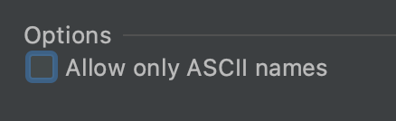

> 이 글을 쓰게 된 계기는 내가 typescript 에서 enum 때문에 고생을 했기 때문이다.

## Enum에 숫자를 넣으면 양방향으로 바인딩된다.

타입스크립트의 enum은 숫자나 문자대신 enum Type으로 쓸 수 있도록 해준다.

예를 들어 Category 를 enum으로 정의한다고 하자.
웹툰 : 1, 웹소설 : 2 영화 : 3 방송 : 4 이렇게 만 정의해보자


```TypeScript
enum Category {
  webtoon = 1,
  webnovel = 2,
  movie = 3,
  broadcast = 4
}
```
이런식으로 코드를 작성할 것이다.

이 코드를 자바스크립트로 다시 컴파일 하면 어떻게 될까?


```TypeScript
"use strict";
var Category;
(function (Category) {
    Category[Category["webtoon"] = 1] = "webtoon";
    Category[Category["webnovel"] = 2] = "webnovel";
    Category[Category["movie"] = 3] = "movie";
    Category[Category["broadcast"] = 4] = "broadcast";
})(Category || (Category = {}));
```

이런식으로 된다.

코드를 보면 좀 어렵지만, `Category` 가 **키와 값을 가진 오브젝트**라는 것은 알 수 있을 것이다.

그런데 위와 같이 문자열에 숫자를 할당한 경우 양방향으로 바꿀 수가 있게된다.

`Category['webtoon'] = 1` 이 보이는가?

`console.log(Category['webtoon'])` 하면 1이 된다.

그런데 `Category[Category["webtoon"] = 1] = "webtoon";` 이렇게 해놨다.

`Category["webtoon"] = 1`은 1이기 때문에 `Category[1]` 은 `webtoon` 이라는 문자열이 된다.

**그렇지만, 숫자가 아닌 문자열을 Enum에 할당하는 경우에는 양방향으로 바인딩 되지 않으니 주의하자.**


```TypeScript
enum Category {
  webtoon = "1",
  webnovel = "2"
}

console.log(Category.webtoon); // 1
console.log(Category["1"]); // 에러
```

## 우리는 보통 Enum의 값과 map을 조합하여 한글을 뽑아낸다.
Category enum을 만들어서 웹툰의 값이 1인것을 알았다. enum과 map을 조합하여 한글 문자열을 얻어와보자.


```TypeScript
enum Category {
  webtoon = 1,
  webnovel = 2
}

const categoryMap = {
  1: "웹툰",
  2: "웹소설"
}

console.log(categoryMap[Category.webtoon]); // 웹툰
console.log(categoryMap[Category.webnovel]); // 웹소설
```

고작 하는일은 웹툰, 웹소설 글자 받아오는 일인데 Enum도 필요하고 categoryMap도 필요하다. 카테고리가 2개지만 이런게 100개씩 있으면 enum에 100개 넣어주고 map도 100개를 작성해야한다. **너무 귀찮다.**

## 그냥 한글로 Enum을 쓰자.
enum이 양방향으로 바인딩 되는 걸 알고 있는데 map을 또 쓸려니 약간 바보같다는 생각이 든다. 그래서 enum에 한글을 쓰기로 했다. 이제 하는일은 숫자와 한글 문자열을 매핑하는게 다였던 categoryMap을 없앨 수 있다. 한글을 쓰는게 좀 어색하지만, 뭐 어떤가. 깔끔하고 우아하다.


```TypeScript
enum Category {
  웹툰 = 1,
  웹소설 = 2
}

console.log(Category[Category.웹소설]); // 웹소설
console.log(Category[Category.웹툰]); // 웹툰
```


> enum에 한글을 쓰는 경우 jetbrains 계열의 IDE에서는 non ascii값을 썼다고 노란줄이 그어지게된다.

> editor > inspections 에서 non ascii 로 검색 후 allow only ASCII names 를 해지해주자.




## 근데 enum을 map으로 만들수도 있지 않을까?

> 만들 수 있다.

아래 함수를 사용하면 된다. 아래 함수를 사용하면 enum에 문자를 사용하는 경우도 map으로 바꿔서 사용할 수 있게 된다. 양방향 바인딩을 못쓰는 경우에 사용하자.

```TypeScript
export function getEnumToMap(enumObject: object) {
  const draftMap = Object.keys(enumObject).reduce<{ [k: string]: any }>((prev, key) => {
    if (!Object.keys(prev).includes(key)) {
      prev[(enumObject as any)[key]] = key;
    }
    return prev;
  }, {});
  const resultMap: { [k: string]: any } = {};
  Object.keys(draftMap).forEach((key) => {
    if ((enumObject as any)[key] === undefined) {
      resultMap[draftMap[key]] = key;
    } else {
      resultMap[key] = draftMap[key];
    }
  });
  return resultMap;
}

const myMap = getEnumToMap(Category);

console.log(myMap);

/*
{
  "웹툰": "1",
  "웹소설": "2"
}
*/
```
이제 타입스크립트 뽀개러 가도록 하자~ 화이팅~


## [추가] enum을 사용하면 tree shaking 이 안된다고 한다.
왜 안되는지는 아래 링크를 참고하자.

[<TypeScript enum을 사용하지 않는 게 좋은 이유>](https://engineering.linecorp.com/ko/blog/typescript-enum-tree-shaking/)

위 링크에서는 enum대신 Union Type 을 쓰는게 좋다고한다.

양방향 바인딩 하고 싶은데… 라는 생각에 swapKeyValueMap 이라는 것을 만들었다.
이게 있으면 어느정도 하고 싶은 것은 할 수 있을 것이다.

```TypeScript
const CATEGORY = {
  웹툰: 1,
  웹소설: 2
};

function swapKeyValueMap(obj: { [k:string]: string|number}) {
  const resultMap: { [k: string]: any } = {};
  Object.keys(obj).reduce<{ [k:string]: string|number}>((prev, key) => {
    resultMap[obj[key]] = key;
    return prev;
  }, {})
  return resultMap;
}


const test = swapKeyValueMap(CATEGORY);

console.log(test);
```

타입스크립트에서 나처럼 enum 때문에 고생을 겪지 않으시길 바라며... 이만 끝!
