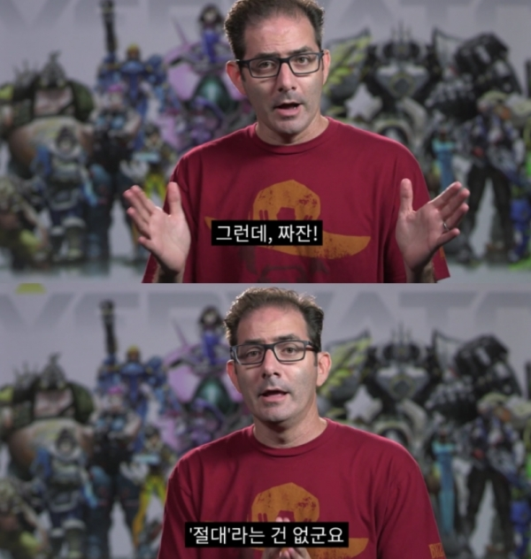
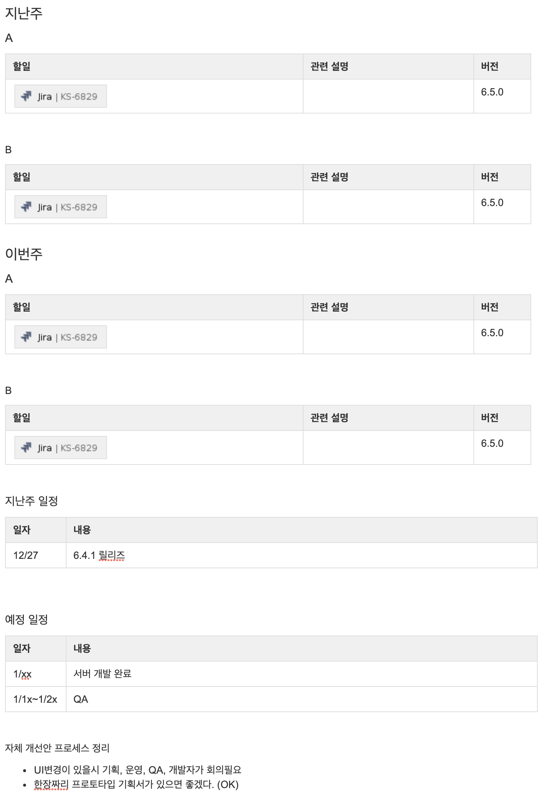

> 이글은 기승전채용의 형식으로 쓰여진 꽤 긴 이야기입니다.  
긴 글을 읽는 게 힘드신 분은 가장 아래에 채용 링크가 있으니 많은 지원 부탁드립니다!!

## 시작하며

이 이야기는 내가 카카오페이지에 재입사하게 되면서, 시작되게 된다. 때는 2017년 12월로 거슬러 올라가게 되는데, 부산에서 많은 고생을 하며 백엔드 서비스를 php에서 go로 갈아엎고 이제 할만하다 싶은 시기가 되긴 했었다. 하지만, 너무 부산의 업무환경이 너무 좋지 않아 원래 그전에 다니던 회사(당시 포도트리)로 다시 재입사를 하게 되었다. 이때는 나도 운영툴만 이렇게 오랫동안 만들고 있게 될 줄은 몰랐다. 사실 운영툴이라는 게 보통 API 다 만들고 테스트하기 귀찮으니깐 짬짬이 후다닥 만들어서 내놓는 툴이 아니던가…  그렇게 생각했고, 그때 당시의 운영툴 상황도 그러했다…

## 2018년 꺼지지 않는 불

내가 입사하고 들어간 곳은 운영툴만 담당해서 제작하는 팀이었다. 사실 그간 해온 일에 비하면 굉장히 난이도는 쉬운 축에 속하기도 해서 별거 아니겠지라고 생각했는데, 웬걸 생각보다 문제가 많았다. 여기서는 그런 문제들을 조금만 풀어보려고 한다.

### 부담되는 레거시

카카오페이지 백엔드 서비스는 slide라는 단일 프로젝트로 시작되었다. 거기에 API도 있고, 파트너 사이트도 있고, 정산, 통계, 광고, 이벤트, 운영툴 모두 다 있는 구조였다. 이렇게 굴러갈 때에는 그래도 서버팀이 6명 정도의 인원이었는데, 하나의 모놀리틱 프로젝트의 소스를 보는 사람들 대부분이 알고 있는 구조였다고 생각하면 된다. 그래서 같이 사용하는 소스들이 굉장히 많았고 여기저기서 가져다 사용할 수 있도록 래핑 되어 있는 소스들이 많았다. 인터페이스는 거의 없고, 메서드가 아주 길고 장대한 구조로 되어 있어서 소스를 파악하는 게 매우 힘들었다.

오자마자 하게 된 일은 레거시를 포팅하는 것이었는데, 반 정도 되는 기능이 레거시에서 돌아가고 있어서 레거시라고 부르기도 좀 뭐한 상황이었다. 그래서 가장 힘들다고 생각되는 것이 두 가지 있었는데, 그중 하나인 작품 관리를 장고로 포팅하기로 했다. 이제야 얘기하지만, 작품 관리 쪽에 기능이 너무나 많아서 그것을 포팅하는데만 2달이 걸렸었다. 그도 그럴 것이 콘텐츠를 서비스하는 회사에서 운영에 핵심적인 것 중 하나가 작품 관리인데, 쉽게 생각한 내가 잘못이었다.

### 배포하면 터지는 서버

이 부분이 너무나 힘들었다. 개발자로 살아오면서 여러 가지 장애를 만나봤지만, 이렇게 어이없는 경우는 난생처음이었다. 배포하면 터지는 이유는… 소스코드는 반영이 되었는데, 디비 테이블이 생성이 안되었다거나 테이블은 있는데 데이터가 없다거나 하는 아주 단순한 이유가 많았고, 그 외에도 기본적인 것을 확인하지 않은 것이 대부분이었다. 황당했다.

이런 어이없는 일을 겪는 게 처음이라, 처음 몇 번은 그냥 있다가 나중에는 배포하기 전에 미리미리 개발자가 하루 전에 테스트해보자고 제안하게 되었다. 메이저 업그레이드가 있는 날은 아침 일찍 나와서 사람들이 출근하기 전에 배포하고 간단한 전수 테스트를 진행하였다. 이를 릴리즈 리뷰라고 불렀다.

그 뒤로도 어이없게 터지는 경우가 한 번씩은 있었지만, 개발자가 진행하는 알파테스트를 넣고 나서는 많이 줄어들었다. 지금 생각해도 이 부분은 잘했다고 생각한다.

> 현재는 개발자가 수시로 테스트 서버에서 테스트하고 있기에, 위의 릴리즈 리뷰는 2019년 6월에 폐지하였다.

### 쓸데없는 컨벤션 논쟁

팀에 합류할 때 개발자 A와 개발자 B가 있었다. 문제는 그들의 성향이 너무나 달랐다는 것이었다. A는 빠르게 만들고 에러를 만나면 고치는 스타일이었으며, B는 스펙을 따져보고 곰곰이 고민하며 만드는 스타일이었다. 코드에도 그러한 성향이 반영되었다. A는 툭하면 함수명 클래스명을 바꿨고 클래스와 패키지의 위치를 이동시켰다. B는 그렇게 작업하는 A를 달가워하지 않았다. 나까지 해서 개발자가 A, B, C가 되었다. 머지하면 충돌이 일상이었다. 리뷰는 없었고 서로 코드의 커밋을 잘 확인해가며 조심조심하며 작업하는 상황이었다. 개발 시의 스트레스가 많았다.

flake8이나 yapf을 도입하려고 하다가 black이라는 아주 강력한 코드 포매터를 찾게 되었고, 팀에 강제로 도입을 하게 되었다. 배포 후에 내가 일괄로 적용을 해버렸다. 그 뒤에도 해당 법칙을 어기는 녀석이 나오면 강제로 적용을 해버렸다. 이제 쓸데없는 컨벤션 논쟁은 사라지게 되었다.

그렇지만, 마음대로 리팩터링 해버리는 문제는 아직 남아있었는데 리팩터링 자체가 나쁜 것은 아니었지만, 리팩터링을 하면서 피쳐 작업을 같이하는 것이 아주 좋지 않다고 보았다. 그래서 이런 경우는 무조건 PR을 올리도록 하였고, 리팩터링 작업과 피쳐 작업을 분리해서 올리도록 하고 나니 점점 좋아졌다. 지금은 1줄을 변경하더라도 무조건 PR을 올리도록 되어 있다.

> black을 도입한 것은 2019년이다. 진즉 도입해야 했는데, 이 때는 불을 끄는 게 더 급했다.

### 잠수함 패치

배포하면 터지는 서버와 연관되는 문제로 잠수함 패치가 있었다. 이게 뭐냐면 배포 스크립트 또는 프로세스를 통해 배포를 하는 것이 아니라 라이브로 돌아가는 서버의 코드를 바로 수정하고 재시작하는 것이었다. 잠수함 패치는 여러 가지 문제가 있지만 대표적으로 두 가지 문제가 있는데, 하나는 문제가 공유되지 않는다는 점이고 다른 하나는 잠수함 패치를 해서 서버가 터지는 상황이 될 수 있다는 것이었다. 운영자들에게 갑자기 운영툴이 동작하지 않아요~!!라는 연락이 와서 살펴봤는데, 잠수함 패치가 되어 있으면 참 기분이 좋지 않았다. 이 문제는 계속해서 설득하고 협박하고 주의를 주어서 몰래몰래 배포하는 경우는 절대 없도록 하였다. 지금은 시니어 두 명에게만(나 포함) 실서버 접근권한을 줘서 그런 문제가 생기지 않게 아예 막아버렸다.  

###  2018년은 정말 불 끄다가 한 해가 지나갔다.

## 2019년 일도 늘고 사람도 늘고…

자, 2018년에는 불을 끄느라 정신없이 지나갔다. 그럼 2019년에는 무엇을 해야 할까? 기존에 문제가 되던 것들을 개선할 차례라고 생각했지만, 광고팀의 업무가 갑자기 우리 팀으로 오게 되었다. 개선 작업은 언제 하지.

### 인사가 만사다

IT업무에서는 정말 그렇다. 불을 많이 껐으니 이제 개선을 하나씩 해야 한다. 그런데 그러려면 사람을 뽑아야 된다. 다행히 고생하는 것을 아셨는지 2019년 1월에 바로 주니어분이 한 분 입사하셨다. 그리고 3월에 또 한 분 입사하셨다. 이제 팀에는 A, B, C, D, E 개발자가 생기게 되었다. 나는 팀장이 되었고, 코드 작성을 60% 매니징을 40% 정도 하는 상황이 되었다. 점점 더 일을 잘 쪼개서 해야 되는 상황이 되어서 기획에서 넘어오는 일을 잘 정리해서 알려드리는 것도 일이 되었다. 이때 프런트 개발자를 뽑지 않은 것은 두고두고 후회하고 있다.

###  광고팀 개발자가 남기고 간 유산 ruby, vuejs

광고팀의 업무를 넘겨받으면서, 3주 동안 인수인계를 받았다. 1주는 루비를 배우고 2주는 vuejs 관련한 내용으로 인수인계를 받게 되었다. 인수인계하면서는 거의 변경될 내용이 없을 것이다 라고 했지만… 굉장히 많은 변화가 있었다고 한다. 그래도 이때 배운 vuejs가 나중에 개선할 때 큰 도움이 되었다. 광고업무는 6개월정도는 개발을 했었고 그 후에는 신규로 생긴 광고팀에 넘겨주게 되었다.                                

> 명심하자 절대라는 건 없다

### 회의를 진행하자

개인적으로는 준비되지 않은 회의를 너무 싫어하기에 팀 회의는 일주일에 한 번 하는 대신 주간 업무 현황을 적어서 함께 보면서 회의를 진행하였다.

회의 문서는 컨플루언스를 사용했고, 사람별로 지난주 할 일, 이번 주 할 일 그리고 공지사항(지난주, 예정), 개선을 위한 의견 이렇게 구성되어 있었다. 사람이 많아지면 개선에 대한 내용은 받기 힘든데, 본인들이 했던 일과 한일 할 일들을 정리하면서 한주를 시작하는 것은 괜찮았다고 개인적으로는 평가한다.                               

### 1년 후를 바라보며 워크숍을 진행하자

아래 이미지는 워크숍을 진행하며 남긴 마인드맵이다. 팀원들은 인식을 하고 있었는지 모르겠지만, 1년짜리 계획을 미리 세우고 업무를 진행하는 것은 매우 좋았었다. 마인드맵에 있는 것을 모두 하지는 못했지만, 굉장히 많은 부분들을 진행할 수 있었고 의미도 있었다. 앞으로도 내가 팀장이 된다면 1년 치 마일스톤을 가지고 진행할 것 같다.                               

### 레거시 없애기2

slide는 정말 없애고 싶었지만, 이미 잘 쓰고 있는 기능이 너무나 많았다. 그래서 시간 날 때마다 팀원들에게 하나씩 자잘한 이슈를 주면서 포팅을 하게 하였다. 그렇지만, 아주 중요한 기능 중에 하나인 심사관리를 포팅하지 못했다.

### 레거시는 계속 불탄다.  

입사 시 처음 한 일이 작업량이 많은 왕급 레거시를 하나 포팅한 것이었는데, 다른 왕급 레거시가 나를 괴롭혔다. 바로 심사툴이었는데, 계속 트랜젝션 문제가 생겼고, SQL 쿼리에 하드코딩으로 넣어둔 상태 값 때문에 계속 버그가 생겼다.

카카오페이지에서 심사는 심사를 위한 팀이 따로 있고 이분들의 하는 일은 심사 툴에서 뷰어를 띄워서 심사를 하는 것이 일어 었기 때문에 굉장히 중요한 도구 중에 하나였다.
우선 레거시에 있는 트랜젝션 문제를 해결하기 위해 심사와 관련된 모든 트랜젝션을 조사하여 트랜젝션이 제대로 닫히지 않는 것으로 보이는 곳을 모두 처리하였다. 그리고 이때부터 레거시 포팅을 위한 마음을 강하게 먹었다.

### vuejs 도입

기존의 운영 툴은 django + bootstrap + jquery로 되어 있는 올드한 구성의 웹페이지였다. 원래 운영툴은 기획이라는 것이 없고 개발자가 원하는 대로 찍어내고 있었는데, 회사가 점차 커지면서 사업부의 요구사항이 많아지게 되었고, 그 요구사항이 계속 개발자에게 직접 오게 되었다. 이 부분이 업무에 지장을 주는 경우가 많아서 운영툴도 기획자가 붙게 되고 기획대로 개발을 하게 되었다. 그런데 기획의 요구사항대로 프런트 페이지를 만드는 게 기존의 django form으로는 너무나 힘든 구성이었다.

django는 기본적으로 form과 model을 매칭 시켜서 화면을 그리고 유효성 검증을 하게 되어 있는데, 기획서대로 만들려면 화면에 N개의 폼이 나와야 하는 형태였다. formset을 쓰면 되지 않느냐고 할 수 있지만, formset은 같은 포맷의 폼이 여러 개인 경우 사용하는 것이고, 만들어야 하는 것은 여러 개의 모델을 한화면에서 조작해야 하는 요구사항이었으며, 동적으로 체크해야 하는 부분(문자열 길이 체크, 이미지 합성 등)들도 있었다.

이런 부분을 해결하기 위해 화면을 reactive 하게 구성할 수 있는 툴이 필요했는데, 광고팀의 업무를 인수인계받으면서 vuejs를 같이 학습하기도 했고, vuejs가 리액트보다는 장고에 붙이기 편해서 vuejs를 사용하게 되었다. UI 프레임워크로는 vuetify와 antdesign을 같이 사용하고 있는데, 이 결정은 굉장히 잘 한 결정이 되었고, 거의 대부분의 기획의 요구사항을 빠르게 수용할 수 있게 되었다.

### django rest framework 도입

기존에는 django의 제네릭 클래스들을 사용하여 API를 만들었으나, 필터링, 권한 관리, json포맷으로 변환 등등을 자동으로 해주는 django rest framework을 도입하였다. 개인적으로는 viewset을 사용하는 것을 권장하는데 viewset을 사용하면 routing 하는 부분을 조금 절약할 수 있기 때문이다. 그리고 자동으로 restful 한 API가 되는 것 또한 덤이었다.  

### black 도입

세상 쓸데없는 논쟁이 팀에서 코딩 컨벤션으로 논쟁하는 것이다. 스페이스를 쓸까 탭을 쓸까, 한 라인에는 몇 자까지 허용할까 등등 이런 논쟁이 실제로 있었고, 서로 맞는 말이라 생각했기 때문에 굉장히 피곤했다. 이 논쟁을 종결시키기 위해 가장 강력한 포매터를 강제로 적용했다.  여기서 포인트는 강제로 했다는 것이다. 이런 문제는 민주적으로 절대 해결되지 않는다. 누군가 그냥 정해줘야 한다. 코딩 컨벤션으로 논쟁할 시간에 검증된 포매터를 적용하고 코드를 한 줄이라도 더 짜자.  

> black을 도입하여 컨벤션을 통일했기에, vuejs는 자연스럽게 prettier를 적용하게 되었다.

### 팀원을 다른 팀으로 보내기

지금은 카카오 웹툰이 론칭이 되어서 다들 알고 있는 사실이지만, 2019년 초부터 글로벌 개발을 시작했었다. 우리 팀에서는 CRM 관련된 기능을 처음부터 끝까지 개발하고 유지 보수한 팀원이 있었기에 그 친구가 글로벌 팀과 협업하여 글로벌 CRM툴을 만들게 되었는데, 잠깐 갈 것처럼 했던 이 팀원은 가서 돌아오지 않았다.. ㅠㅠ

또한 광고 도메인도 우리 팀에서 함께 맡고 있었는데, 광고 관련된 업무를 많이 맡고 있던 팀원도 새롭게 생긴 광고팀으로 이동하게 되었다. 이제 우리 팀에는 A, C, D 요렇게 3명의 개발자가 남았다.

> 2019년은 두 명의 개발자가 들어왔다 다시 나가고, 광고업무도 잠깐 보았다가 다시 없어지는 등
변화가 많았던 해 이기도 하고 매니징을 나름대로는 굉장히 열심히 했던 해로 기억한다.

### hashicorp vault 도입

회사가 커지면서 보안 검수를 실시하게 되었는데, 보안검수중 민감정보(DB연결정보등)가 소스코드에 있는것이 지적되어서, hashicorp vault를 도입하게 되었다. django settings.py 에서 장고 기동시 민감정보를 받아오게 되는데, 데커레이터의 동작을 정확하게 알고 사용해야하는 부분들이 재밌었던 작업으로 기억하고 있다.

### 팀 스터디

전문가를 위한 파이썬, MDN의 자바스크립트, 데이터 중심 애플리케이션 설계 이렇게 3가지 주제로 스터디를 하게 되었는데, 이것을 계기로 회사 내에서는 스터디를 잘 진행하는 사람으로 알려지게 되었다. 중간에 발표 준비를 빼먹거나 바빠서 못하거나 하는 경우가 한 두 주 정도 있었지만, 그래도 스터디를 전부 완주하였고 이 때문에 나도 팀원들도 역량이 조금씩은 자란 것 같아서 뿌듯했던 경험이었다.

## 2020년 개선에 속도가 붙다.

2019년에 팀장이 되면서 매니저 역할과 코딩을 둘 다 하긴 했지만, 실제로 퀄리티가 조금 아쉽고 개선이 아니라 미봉책에 머무는 녀석들이 눈에 계속 들어왔다. 이 부분이 너무 아쉬워서 회사에 건의하여 팀장 역할을 내려놓고 코딩을 열심히 하기로 하였다.

> 팀장으로 있으면서도 개발을 더 많이 하는 방법이 있었을 것 같기도 하다. 하지만 개인적으로는 잘한 결정이라고 생각한다.

### 대부분의 레거시를 걷어냄

slide 프로젝트에 있는 거의 모든 기능을 포팅했다. 특히나 심사관리는 아주 중요한 툴이라서 조심조심 진행했는데, SQL에 상태가 하드 코딩되어 있던 문제는 transitions라는  상태 머신을 적용하여 해결했다. 웹뷰도 포팅을 했어야 했는데, 웹뷰가 실제 서비스에 쓰던 녀석이라 생각보다 기능이 많아서 웹뷰는 남겨두게 되었다. 이제 정말로 끝이 보인다.

### Ansible 적용

이전에는 서버의 상태를 puppet으로 관리하고 있었는데, puppet에는 자바 관련된 코드만 작성되어 있고, 파이썬 관련은 없어서 새로운 서버를 구축해야 하면 처음부터 한 땀 한 땀 구축해야 했다. 마침 2020년에 카카오에서 테스트 서버 존을 이전해달라는 요청이 왔는데, 이때가 기회다 싶어서 ansible을 적용하여 서버를 구축하기로 하였다.

이 선택도 잘했다고 생각하는데, ansible은 서버가 따로 필요 없어서 설치가 굉장히 간편했고, 설정도 yaml로 깔끔하게 할 수 있었으며 템플릿에서는 python과 jinja문법을 사용할 수 있어서 나름 익숙한 문법으로 진행할 수 있었다. 이제는 신규로 서버를 설치해야 하면 한방에 설치할 수 있게 되었다.

이때 운영서버뿐 아니라 카카오페이지 서비스를 위한 모든 서버를 커맨드 한방에 설치할 수 있게 변경하였다.

> 여담
1. 사실 puppet으로 파이썬 환경 설치하는 것도 2019년에 진행하긴 했었다.
2. 나중에 기존의 서버가 노후화되어서 리얼서버도 ansible로 구축하게 되었다.
3. 은전 한 닢 + ES 5 설치는 진짜 난이도가 너무 높아서 짜증이 많이 났었다. → nori로 변경함.

### 푸시 운영 툴 재작성

기존의 푸시는 celery(생산자/소비자) + rabbitmq로 되어 있었는데, celery가 기존의 django와 의존성이 있게 작성되어 있고 모니터링을 붙이는 게 용이하지 않아서 새로 작성하게 되었다. java로 다시 작성했고, 이때 속도조절 기능과 블랙리스트, 화이트리스트 기능을 추가로 붙였고 덤으로 모니터링과 안정적인 성능까지 얻을 수 있게 되었다.

> 카카오 인프라상에서는 자바로 만든 서버의 모니터링이 가장 강력하다. APM, AEM 모두 지원한다.

### 테마(큐레이션) 기능 재작성

카카오 페이지에는 테마라고 불리는 운영자가 만드는 큐레이션 기능이 있다. 기존의 테마보다 한 단계 업그레이드된 기능을 추가했는데, 배너를 추가하거나 벌크로 세팅하거나 하는 기능들을 추가했다. 또한 기존에는 몇 백개씩 세팅을 하면 읽기 속도가 상당히 느렸는데, django의 cache를 사용해서 쿼리를 절약하였다.

### 장고 버전업 1.11 → 2.2

장고 버전업은 LTS버전이 변경될 때마다 해주고 있는데, 너무 안 하다가 한 번에 업그레이드를 하려고 하면 너무 힘들기 때문이었다. 1.11에서 2.2로 업그레이드될 때 짜증 났던 점 한 가지는 pymysql지원이 갑자기 안돼서 울며 겨자 먹기로 mysql client를 사용했던 점이다.

> 2021년 9월 3.2로 업그레이드를 완료했다.

### vuex를 적용하다

vuejs를 사용하면서 상태 관리를 좀 더 잘하고 싶은 마음에 vuex를 적용하게 되었다. 실제로 써본 느낌은 뭔가 자바 배울 때 getter/setter를 손으로 짜는 기분이었지만, 전역으로 상태를 관리할 수 있게 되어서 컴포넌트를 조금 더 재활용할 수 있는 형태로 변경할 수 있게 되었다.

### 감사 로그(audit log) 남기기

회사가 상장한다는 얘기는 계속 있어왔는데, 정말로 할 것같다라고 느낀 것은 ISMS 심사를 받아야 해서 감사 로그를 남기도록 개발을 진행하면서부터이다. 운영 툴은 성격상 개인정보도 다루고, 기타 민감한 정보들을 다루게 되어 있는데, 이 부분에 대한 로그들이 조금 미진한 부분들이 있었다. 마침 사내에 loki라는 전사 로깅 플랫폼이 생겨서 로깅 플랫폼을 적용하여 감사 로그를 쉽게 남길 수 있게 되었다.

> 운영자가 실수하고 개발에 연락 오는 경우 로그로 확인시켜줄 수 있게 된 것은 덤이다.

### 배치 개선

기존에는 crontab을 사용해서 운영툴의 api를 호출하거나 django management를 사용하도록 되어 있었는데, 데이터 플랫폼 팀에서 airflow를 지원해주어서 airflow의 DAG를 호출하도록 변경하였다. 다만 airflow가 바쁜 경우 배치가 밀리는 경우가 있어서 배치 서버를 따로 구축했다.

### 팀원 두 명의 퇴사 그리고 두 명의 입사

2020년 8월 9월에 팀원 A와 D가 비슷한 시기에 퇴사를 하게 되었다. 이들의 퇴사 의사 표명 몇 개월 전에 시니어분이 합류하셨었는데, 아직 업무파악 중이라 많은 것을 하기는 좀 힘들었지만, A가 담당하고 있던 푸시 시스템 재작성을 시니어분에게 맡겼다. 그리고 나머지는 나 홀로 개발을 해야 하는 상황이 되어서 굉장히 피곤했는데, 어떻게든 되겠지 하는 마음으로 열심히 개발을 하면서 지냈다. 그 와중에 주니어 한분도 입사하시고 잘 적응하고 계신다.

> 어떻게든 되겠지라는 마인드도 가끔은 필요하다.

## 2021년 더 더 더 개선하자

드디어 2021년이다!! 그동안 django + bootstrap + jquery로 되어 있던 운영 툴을 django + DRF + vuejs + vuetify + antd로 변경했다!!

 그리고 오래된 레거시를 거의 걷어내었다. 2021년에는 더 신나는 일들이 벌어지고 있는데 작업하고 있는 것과 앞으로 할 일들을 조금 적어보도록 하겠다.

### 레거시 완전히 종료!

2018년부터 작업했던 slide 걷어내기 작업이 드디어 끝이 난다. 레거시를 걷어내면 이제 개발을 더 빠르게 할 수 있다. 그리고 기존의 django 프로젝트가 레거시가 될 것이다!

### 신입 두 분의 입사!

우리 팀은 약간 훈련소 같은 느낌이다. 다른 팀의 팀원의 변동이 거의 없는 동안 나 빼고 새로 다 바뀌었다. (이제 내가 바뀔 차례인가…) 이번에는 신입 두 분이 오셨는데, 한분은 백엔드, 한분은 프런트를 위주로 하시는 분이었다. 특히나 프런트 하는 분은 신입이지만 팀에 매우 힘이 되고 있다~

### vuejs에서 react로~!

vuejs는 잘 사용하고 있지만, vuejs2에서 3으로 마이그레이션 하는 코스트가 너무나 커서 마이그레이션을 못하고 있다. 고민을 하다가 화면 관리 운영 툴의 프런트를 새로 만들기로 하고 해당 운영툴은 react를 사용하기로 했다. react를 회사 내 웹팀에서 사용하고 있어서 기술 관련 지원을 받을 수 있을 것이라고 예상하고 react가 vuejs보다는 유지 보수하기 좋을 것 같다는 판단을 내려서 함께 리액트를 공부하며 새로 만들고 있다.

### ansible에서 kubernetes로~!

예전부터 도커는 사용을 하고 있었지만, 적용을 못하고 있었는데 카카오 공동체도 DKOS3라는 쿠버 네티스 엔진을 지원하는 클라우스 서비스를 사용할 수 있게 되어서 새로운 프로젝트는 k8s를 적용하려고 준비하고 있다. 이에 CI는 기존과 같이 젠킨스를 쓰지만 CD는 argocd를 사용하려고 준비 중에 있다.

### CDC 적용하기

페이지 서비스의 작품은 수만 개가 되는데, 작품이 판매 시작되는 시점이 서비스적으로는 굉장히 중요하다. 예를 들어 판매 시작되는 시작이 22시 라면 그 시간에 보여야 하는데, 캐시가 딱 그 시간에 적용이 안되고 1~3분 정도 밀리는 현상이 가끔 있다. 또한 페이지 서비스 내의 서버들은 최신의 상태의 작품 정보를 읽어와야 하는데 모든 서버들이 디비를 사용하면 디비에 부하를 주게 된다. (현재는 그렇다.) 그래서 CDC를 적용하여 작품과 회차의 상태를 실시간에 반영할 수 있도록 하고 검색을 위한 인덱스도 실시간으로 개선하는 작업을 하려고 진행 중이다.  

### graphql 도입

리액트에서 restapi를 호출하면 redux를 사용하고 상태를 굉장히 번거롭게 관리를 해야 하는데, 웹팀에서 graphql을 쓰면 간단하게 된다고 하여 장고 서버에 graphql을 도입하였다. DRF에 비하면 번거로운 부분들이 있지만, 엔트리 포인트가 하나밖에 없기 때문에 router를 작성하지 않아도 되고, 모델에 대한 resolve함수를 하나만 작성해두면 모두가 클라이언트에서 쉽게 가져다 쓸 수 있는 점이 매력적이었다. 다만 react도 하면서 graphql도 공부하면서 적용하려니 러닝 커브가 좀 있었다.

## 운영 툴을 잘 만들어야하는 이유가 있을까?

마무리로는 운영 툴 개발을 쉽게 생각했던 과거의 나에게 반성하며 운영 툴을 잘 만들어야 되는 이유가 무엇인지 잠깐 생각해보고자 한다. API 개발은 트래픽을 잘 받아서 서비스를 잘 지탱할 수 있게 하는 탱커 역할의 개발이다. 들어오는 트래픽을 받기 위한 개발이다.

반면에 운영툴은 사용자에게 노출되는 서비스를 빠르고 정확하게 바꿀 수 있게 하고 때로는 사용자에게 메시지를 보내서 사용자를 끌어모을 수 있게 하는 서비스를 노출시키는 딜러 역할의 개발이다. 즉 외부로 나가는 트래픽을 만드는 개발인 것이다. API가 견고하여 서버가 죽지 않는다고 하여도 사용자가 찾아오지 않으면 소용이 없다. 그런 의미에서 서비스를 잘 노출시켜줄 수 있도록 도와주는 서비스도 API에 못지않은 역할을 한다고 할 수 있을 것이다.

운영툴 개발은 기술적 난이도는 사실 API보다는 낮지만, 반면에 다방면의 재능이 필요하다. 프런트 작업도 해야 하고 벡엔드도 해야 하고 인프라도 일부 해야 한다. 작업도 CRUD를 만드는 일부터 비동기 태스크, 배치작업, 화면을 리액트로 만드는 작업등 많은 범위를 커버한다. 그래서 카카오페이지 서비스에서는 해당 직군을 풀 스택 개발로 정의하고 채용을 하고 있다.

앞으로는 백엔드도 API와 똑같은 스택으로 맞추기 위해 django에서 kotlin으로 변경하려고 하고 있다. 나름 다이내믹하고 개선할 부분이 무한대로 있는 국내/글로벌 카카오 페이지 운영툴 개발에 관심이 있는 사람은 아래 링크를 통해 문을 두드려 주면 좋겠다. 운영툴 개발뿐 아니라 다른 테크 직군도 적극 채용중이니 문을 두드려 주시면 좋겠다.

[www.kakaoent-entertech.com](www.kakaoent-entertech.com)

> 개인적으로는 카카오엔터테인먼트에 면접만 보더라도 개인적으로는 손해는 아닐것이라 확신한다. 왜냐하면, 면접관들이 3일전부터 이력서 보면서 질문리스트 만들고, 그 질문 리스트를 바탕으로 질문을 드리기 때문이다. 최대한 개인 맞춤형 면접을 해드리기 위해 정말 많이 노력한다. (나도 시간을 굉장히 많이 쓰는 편이다.)
