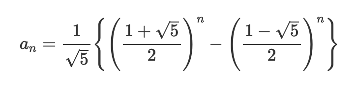

피보나치 수열은 다들 들어보셨을 겁니다.

```
1, 1, 2, 3, 5, 8, 13...
```

이전의 두 수를 더한 값이 다음번 숫자가 되는 수열입니다.
코딩 문제로 자주 나오기도 하고 그래서 한번 정리해봤습니다.
사실 행렬로 푸는 방법이 한가지 더 있는데, 그건 파이썬하고는 별로 관계가 없어서 뺏습니다.

본 문서에서는 총 3가지 방법으로 피보나치 수열을 구현할 것입니다.
이 문서를 제대로 이해하게 되면 덤으로 파이썬 데커레이터와 제너레이터에 대한 기본적인 지식도 얻을 수 있습니다.

그럼 시작하겠습니다.

## 첫번째 방법 : 재귀

첫번째 방법은 재귀로 푸는 방법입니다. 수학적 정의와 아주 동일하게 풀어낼 수 있습니다.
깊이가 한단계 들어갈 때마다 2개의 함수를 호출해야하기 때문에 시간 복잡도는 O(2^n) 이 됩니다.

```python
def fibo(n: int) -> int:
    # 재귀사용 O(2^n)
    if n <= 2:
        return 1
    return fibo(n - 1) + fibo(n - 2)
```

이 방법은 코드는 간단하지만, 문제가 있는데 매우 느리다는 것입니다.
이유는 fibo(5)를 구하기 위해서는 아래의 식과 같이 구해야하는데,
보시면 `fibo(3), fibo(2)` 가 여러번 반복되는 것을 볼 수 있습니다.

```
fibo(5) = fibo(4) + fibo(3)
fibo(4) = fibo(3) + fibo(2)
fibo(3) = fibo(2) + fibo(1)
fibo(2) = fibo(1)
```

## 두번째 방법 : for loop

이번에는 for loop 으로 두변수의 값을 계속 치환하면서 구해보도록 하겠습니다.
파이썬에서는 두개의 변수를 동시에 치환 할 수 있기 때문에 아래와 같은 구문이 가능합니다.

```
a, b = b, a + b
```

이 방법을 이용하면 속도도 O(N) 으로 빠르게 값을 구할 수 있습니다.

```python
def fibo2(n: int) -> int:
    # for loop O(N)
    if n <= 2:
        return 1

    a, b = 0, 1
    for x in range(n - 1):
        a, b = b, a + b
    return b
```

그러나, 만약에 N번째 피보나치수가 아니라 첫번째부터 N번째까지의 피보나치수를 구하고 싶다면?
숫자가 증가할 때마다 이전의 피보나치수를 처음부터 다시 계산하게 됩니다. 그러면 이또한 복잡도가
`( 1 + N) * N / 2` 의 복잡도로 O(N^2) 이 될것이고 많이 느리지는 않겠지만, 그래도 충분히 빠르다고는 할 수 없을 것입니다.

## 두번째 방법 개선하기

두번째 방법을 개선하기 위해서 캐시를 추가할 수 있습니다.
그러면 이미 구한 숫자에 대해서는 따로 계산을 하지않고 캐시에서 가져오기 때문에 상수시간에 계산을 할 수가 있게 됩니다. 간단한 캐시를 구현해서 2번 피보나치 함수에 붙여보겠습니다.

```python
def my_cache(func):
    # 반복연산을 방지하기위한 간단한 캐시
    cache_dict = {}

    def cached(*args):
        if args[0] in cache_dict:
            return cache_dict[args[0]]
        result = func(*args)
        cache_dict[args[0]] = result
        return result

    return cached


@my_cache
def fibo2_with_cache(n: int) -> int:
    # 속도향상을 위해 캐시를 붙였다.
    return fibo2(n)
```

위의 코드에서 `my_cache` 라는 데커레이터를 만들어서 붙였습니다. 데커레이터에서는 미리 캐싱을 위한 딕셔너리를 만들고, 함수의 파라메터를 키로 결과를 값으로 저장하게 됩니다. 그래서 함수 실행시에 이미 캐시에 있는 값이라면 캐시에서 값을 꺼내와서 리턴해주게됩니다.

이런 간단한 캐시를 추가함으로써 1부터 N개까지의 피보나치수를 구하는 속도가 더욱 빨라지게 되었습니다.
한번씩만 연산을 하게 되므로 1부터~N까지 피보나치 수 구하기는 처음에는 O(N^2) 이겠지만, 두번째부터는 O(1)의 복잡도로 구할 수 있을 것입니다.

## 세번째 방법 : 제너레이터 사용하기

파이썬에는 무한한 수열을 다루기 위한 장치로 제너레이터라는 기능이 있습니다. 제너레이터 하나만으로 문서 여러개를 작성할 수 있기 때문에 여기서는 제너레이터에 대해서는 다루지 않고, 제너레이터를 사용해서 피보나치 수열을 만드는 것만 해보겠습니다.

```python
def fibo3(n):
    # 제너레이터를 사용한 버전
    # 캐시가 필요없다.
    # O(N)
    a, b = 1, 1
    for n in range(n):
        yield a
        a, b = b, a + b

```

다른 함수들과 다른 특징은 바로 `return` 이 없고 `yield` 가 있다는 것 입니다. 편하게 `yield` 가 될 때 a 가 리턴된다고 생각하시면 됩니다. 또한 제너레이터는 이터레이터의 성질을 모두가지고 있어서 for 루프에 넣을 수 있습니다.

아래와 같이 for in 구문에 넣으면 1~N 까지의 피보나치수를 아주 간단하게 구할 수 있습니다.

```python
for n in fibo3(3):
    print(n)
```

문법이 조금 익숙하지 않을뿐 매우 우아한 방법으로 무한한 수열을 다룰 수 있습니다.

## 수학공식을 사용한 방법

저도 찾다가 알게된 것인데, 아래 그림과 같은 피보나치 수열의 일반항 공식이 있습니다.



파이썬하고는 관계없지만, 개발을 하다보면 다른 사람이 만들어둔 알고리즘을 보고 구현해야 되는 경우도 있어서
한번 공식대로 만들어 본것입니다. 값이 잘 나오는 것이 신기합니다.

```python
def fibo4(n):
    # 공식을 활용한 버전
    # 상수시간이므로 O(1)
    root5 = pow(5, 0.5)
    ratio = (1 + root5) / 2
    return int((pow(ratio, n) - pow(1 - ratio, n)) / root5)

```

### 그외 참고

위키페디아를 보면 행렬을 사용하는 방법도 있는 것 같습니다만,
이렇게 이 문제를 풀어야할 필요성을 잘 못느껴서 일단 스킵했습니다. 궁금하신 분은 위키페디아를 참고해주세요~

### 출처

- https://www.python-course.eu/generators.php
- https://www.mathfactory.net/10454
- https://en.wikipedia.org/wiki/Fibonacci_number
