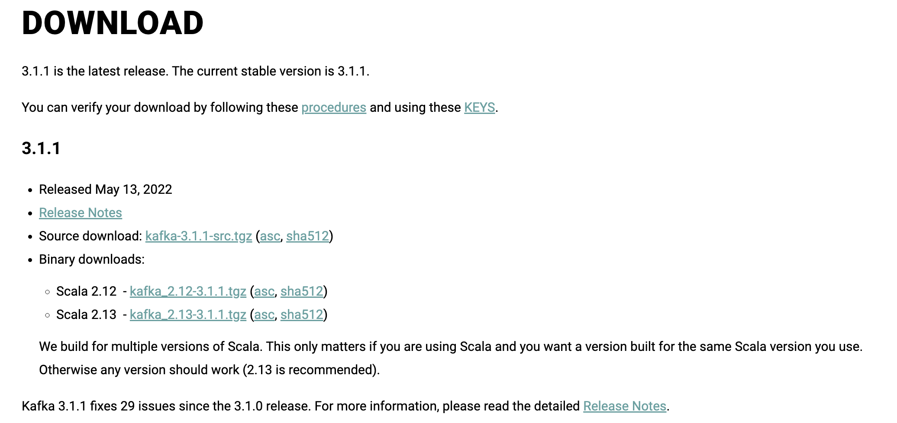

## 카프카란?

- 대용량, 대규모 메시지 데이터를 빠르게 처리하도록 개발된 메시징 플랫폼. 
- 홈페이지에는 고성능 데이터 파이프라인, 스트리밍 분석, 데이터 통합, 미션 크리티컬한 애플리케이션을 위한 분산 이벤트 스트리밍 플랫폼으로 소개하고 있음. 
- 기술에 보수적인 제조사, 통신사, 은행, 보험사 중 가장 큰 곳들은 대부분 사용한다고 함. 

자세한 것은 [The Log](https://engineering.linkedin.com/distributed-systems/log-what-every-software-engineer-should-know-about-real-time-datas-unifying)라는 글을 읽어보면 좋다. 


## 카프카 설치 

- [https://kafka.apache.org/downloads](https://kafka.apache.org/downloads) 에서 바이너리 버전을 받아서 압축 풀기. $HOME 디렉토리에 압축을 풀었다고 가정함   

- 나는 대충 최신 버전을 받았음 어차피 바이너리라...
- 직접다운로드 링크는 여기 [**https://dlcdn.apache.org/kafka/3.1.1/kafka\_2.13-3.1.1.tgz**](https://dlcdn.apache.org/kafka/3.1.1/kafka_2.13-3.1.1.tgz)


  


### 주키퍼 시작하기 

카프카는 주키퍼에 의존성이 있음. 그러므로 주키퍼를 먼저 시작시켜줘야함.

다음 스크립트로 실행. 

```
~/kafka_2.13-3.1.1/bin/zookeeper-server-start.sh ~/kafka_2.13-3.1.1/config/zookeeper.properties
```


데몬모드

> \-daemon 플래그를 붙이면 주키퍼를 데몬모드로 올릴 수 있음. (백그라운드에서 돈다는 뜻)


잘은 모르겠지만, 뭔가 많은 로그가 올라가면서 주키퍼가 기동됨 

```
[2022-05-14 23:36:17,913] INFO   ______                  _                                           (org.apache.zookeeper.server.ZooKeeperServer)
[2022-05-14 23:36:17,913] INFO  |___  /                 | |                                          (org.apache.zookeeper.server.ZooKeeperServer)
[2022-05-14 23:36:17,913] INFO     / /    ___     ___   | | __   ___    ___   _ __     ___   _ __    (org.apache.zookeeper.server.ZooKeeperServer)
[2022-05-14 23:36:17,914] INFO    / /    / _ \   / _ \  | |/ /  / _ \  / _ \ | '_ \   / _ \ | '__| (org.apache.zookeeper.server.ZooKeeperServer)
[2022-05-14 23:36:17,914] INFO   / /__  | (_) | | (_) | |   <  |  __/ |  __/ | |_) | |  __/ | |     (org.apache.zookeeper.server.ZooKeeperServer)
[2022-05-14 23:36:17,914] INFO  /_____|  \___/   \___/  |_|\_\  \___|  \___| | .__/   \___| |_| (org.apache.zookeeper.server.ZooKeeperServer)
[2022-05-14 23:36:17,914] INFO                                               | |                      (org.apache.zookeeper.server.ZooKeeperServer)
[2022-05-14 23:36:17,914] INFO                                               |_|                      (org.apache.zookeeper.server.ZooKeeperServer)
```


## 아파치 카프카 시작하기 

다른 터미널 창에서 다음과 같이 실행

```
~/kafka_2.13-3.1.1/bin/kafka-server-start.sh ~/kafka_2.13-3.1.1/config/server.properties
```


뭔가 많이 뜨면서 에러가 안나면 성공. 포트는 9092 인듯 


```
[2022-05-14 23:39:24,954] INFO [ThrottledChannelReaper-Fetch]: Starting (kafka.server.ClientQuotaManager$ThrottledChannelReaper)
[2022-05-14 23:39:24,956] INFO [ThrottledChannelReaper-Produce]: Starting (kafka.server.ClientQuotaManager$ThrottledChannelReaper)
[2022-05-14 23:39:24,956] INFO [ThrottledChannelReaper-Request]: Starting (kafka.server.ClientQuotaManager$ThrottledChannelReaper)
[2022-05-14 23:39:24,958] INFO [ThrottledChannelReaper-ControllerMutation]: Starting (kafka.server.ClientQuotaManager$ThrottledChannelReaper)
[2022-05-14 23:39:24,974] INFO Log directory /tmp/kafka-logs not found, creating it. (kafka.log.LogManager)
[2022-05-14 23:39:25,005] INFO Loading logs from log dirs ArraySeq(/tmp/kafka-logs) (kafka.log.LogManager)
[2022-05-14 23:39:25,010] INFO Attempting recovery for all logs in /tmp/kafka-logs since no clean shutdown file was found (kafka.log.LogManager)
[2022-05-14 23:39:25,017] INFO Loaded 0 logs in 11ms. (kafka.log.LogManager)
[2022-05-14 23:39:25,018] INFO Starting log cleanup with a period of 300000 ms. (kafka.log.LogManager)
[2022-05-14 23:39:25,020] INFO Starting log flusher with a default period of 9223372036854775807 ms. (kafka.log.LogManager)
[2022-05-14 23:39:25,315] INFO [BrokerToControllerChannelManager broker=0 name=forwarding]: Starting (kafka.server.BrokerToControllerRequestThread)
[2022-05-14 23:39:25,480] INFO Updated connection-accept-rate max connection creation rate to 2147483647 (kafka.network.ConnectionQuotas)
[2022-05-14 23:39:25,484] INFO Awaiting socket connections on 0.0.0.0:9092. (kafka.network.Acceptor)
```


### $PATH에 환경변수 설정하기 

`kafka_2.13-3.1.1/bin`  은 자주 사용하게 될 것이니, 귀찮으면 PATH에 등록해도 됨.   


.zshrc 나 .bash\_profile등에 다음과 같이 하면됨. 

```
PATH="$PATH:~/kafka_2.13-3.1.1/bin"
```


### 카프카와 주키퍼의 데이터 저장 디렉터리 변경하기 (옵션)

주키퍼의 경우 : `zookeeper.properties`  의 dataDir 값을 변경하면 원하는 곳으로 데이터 저장 디렉터리를 변경할 수 있다. 

카프카의 경우 : `server.properties`   의 log.dirs 를 원하는 디렉터리로 변경하기


### 심볼릭 링크만들기 (옵션)

kafka\_2.13-3.1.1 이렇게 매번 타이핑하기 귀찮으니 `kafka`  로 심볼릭 링크를 만들자. 

이렇게 하면  조금 편하게 카프카 디렉터리로 접근할 수 있다. 

```
ln -s kafka_2.13-3.1.1 kafka
```


## 토픽 만들고 삭제하기 

만들기

```
./kafka/bin/kafka-topics.sh --create --topic andy-test-topic --bootstrap-server loc
alhost:9092 --replication-factor 1 --partitions 1
```


삭제하기

```
./kafka/bin/kafka-topics.sh --delete --topic andy-test-topic --bootstrap-server loc
alhost:9092
```


> 카프카 2.x.x를 사용하는 경우 --boostrap-server 대신 --zookeeper localhost:2181 을 사용해야함


## 토픽 조회하기 


```
./kafka-topics.sh --list --bootstrap-server localhost:9092
andy-test-topic
```


\--describe 를 사용하면 상세정보 나옴


## 토픽에 메시지 보내기

키를 지정하지 않고 메세지 보내기 

```
./kafka-console-producer.sh --broker-list localhost:9092 --topic andy-tes
t-topic
```


이것 저것 입력후 Ctrl + C 로 빠져나오기 

```
> 안녕하시요.
>hello kafka
>nice to meet you
```


키를 지정하려면 다음과 같이 해야함 


```
./kafka-console-producer.sh \
  --broker-list localhost:9092 \
  --topic andy-test-topic \
  --property "parse.key=true" \
  --property "key.separator=:"
```


## 컨슈머로 읽기

```
./kafka-console-consumer.sh --bootstrap-server localhost:9092 --topic and
y-test-topic --from-beginning
```


결과값

```
안녕하시요.
hello kafka
nice to meet you
```


## 카프카 테스트 프로젝트 

### gradle 설정

**confluent 저장소 추가 하기** 

```
repositories {
    mavenCentral()
    maven {
        url "https://packages.confluent.io/maven"
    }
}
```


카프카 클라이언트 의존성 추가  (스트림즈도 공부할거라 스트림즈도 넣어줌)

```
implementation 'org.codehaus.groovy:groovy-all:3.0.5'
testImplementation 'org.junit.jupiter:junit-jupiter-api:5.7.2'
testRuntimeOnly 'org.junit.jupiter:junit-jupiter-engine:5.7.2'
implementation 'org.apache.kafka:kafka-clients:3.1.1'
implementation 'org.apache.kafka:kafka-streams:3.1.1'
implementation 'org.slf4j:slf4j-api:1.7.36'
implementation 'org.slf4j:slf4j-simple:1.7.32'
```


Helloworld 클래스 만들기 

me.gyus.demos.kafka 패키지로 만들자. 


### 프로듀서 테스트

```
package me.gyus.demos.kafka;


import org.apache.kafka.clients.producer.KafkaProducer;
import org.apache.kafka.clients.producer.ProducerConfig;
import org.apache.kafka.clients.producer.ProducerRecord;
import org.apache.kafka.common.serialization.StringSerializer;
import org.slf4j.Logger;
import org.slf4j.LoggerFactory;

import java.util.Properties;

public class ProducerDemo {
    private static final Logger log = LoggerFactory.getLogger(ProducerDemo.class);

    public static void main(String [] args) {
        log.info("I am a kafka Producer");
        String bootstrapServers = "127.0.0.1:9092";

        Properties properties = new Properties();
        properties.setProperty(ProducerConfig.BOOTSTRAP_SERVERS_CONFIG, bootstrapServers);
        properties.setProperty(ProducerConfig.KEY_SERIALIZER_CLASS_CONFIG, StringSerializer.class.getName());
        properties.setProperty(ProducerConfig.VALUE_SERIALIZER_CLASS_CONFIG, StringSerializer.class.getName());

        // create the producer
        KafkaProducer<String, String> producer = new KafkaProducer<>(properties);
        for (int i=0;i<10; i++) {
            String topic = "demo_java";
            String value = "hello world " + i;
            String key = "id_" + i;
            ProducerRecord<String, String> producerRecord = new ProducerRecord<>(topic, key, value);
            producer.send(producerRecord, (metadata, e) -> {
                if (e == null) {
                    log.info("Received new metadata. \n" +
                            "Topic:" + metadata.topic() + "\n" +
                            "Key:" + producerRecord.key() + "\n" +
                            "Partition: " + metadata.partition() + "\n" +
                            "Offset: " + metadata.offset() + "\n" +
                            "Timestamp: " + metadata.timestamp());
                } else {
                    log.error("Error while producing", e);
                }
            });

            try{
                Thread.sleep(1000);
            } catch(InterruptedException e) {
                e.printStackTrace();
            }
        }

        producer.flush();
        producer.close();

    }
}
```

## 참고 

[https://www.sohamkamani.com/install-and-run-kafka-locally/](https://www.sohamkamani.com/install-and-run-kafka-locally/)
