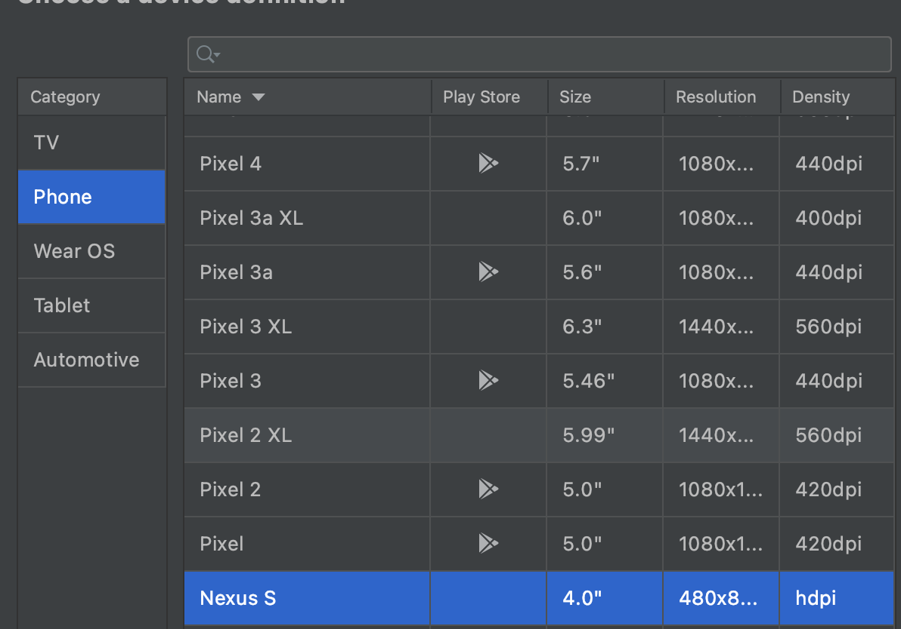

> 회사에서 안드로이드 에뮬레이터 띄워서 테스트시에 요청이 올바르게 오는지 필요해서 깔아봤는데, 인증서 설치가 매우 힘들었다. 안드로이드 API 버전을 8이하로 하면 매우 쉽게 된다고 한다. 그렇지만 그 이상으로 테스트 해야되는 경우 필요할 것 같아서 남겨둔다.

## 준비물

안드로이드 스튜디오, 안드로이드 SDK → 안드로이드 가상 디바이스 를 만들기 위해서 필요하다.
가상 디바이스를 만들고 난 다음 부터는 emualtor 명령어로 켜면됨.


> 주의

안드로이드 가상 디바이스를 만들때는 play store 딱지가 없는 녀석으로 해야 proxy설정이 가능하다!




## mitmproxy 사용해보기

```
# 설치
brew install mitmproxy

# 실행
mitmproxy -p {포트}
```


## 안드로이드 에뮬레이터에 proxy 설정하기

안드 에뮬레이터에서 설정 (번거로우니 안하는게 좋을듯)


```
Network details → (연필누름) → Advanced Options → Proxy → ip와 port 설정후 저장
```

에뮬레이터가 실행중 일때 adb로 세팅 할 수 있음. [여기](https://compiler.tistory.com/29)참고

```
adb shell settings put global http_proxy 아이피:포트

# 프록시 설정 해제
adb shell settings put global http_proxy :0

```

## mitm 인증서 설치
굉장히 귀찮고 주의할 점이 많으니 차근 차근 진행하자.


### 1. 준비물

안드로이드 SDK의 emulator, adb 명령어를 사용할 수 있게 패스에 추가하자.

나는 아래와 같이 해줬음.

```
export PATH=$PATH:$HOME/Library/Android/sdk/emulator:$HOME/Library/Android/sdk/platform-tools
```

일단 에뮬레이터 시작시 `-writable-system` 옵션을 꼭 넣어줘야 한다. 그리고 adb root 명령을 사용할 수 있어야하는데, 위에서 안드로이드 가상 디바이스를 만들때 play store 딱지가 있으면 adb root를 사용할 수 없으니 주의!


### 2. 인증서 이름 바꾸기

mitmproxy를 설치하면 ~/.mitmproxy 디렉토리 아래에 가짜 인증서가 들어 있다.

아래 명령을 실행해서 인증서를 카피한다. 그러면 c8750f0d.0 같은 이름의 파일이 생긴다.

```
hashed_name=`openssl x509 -inform PEM -subject_hash_old -in mitmproxy-ca-cert.cer | head -1` && cp mitmproxy-ca-cert.cer $hashed_name.0
```

### 3. 인증서를 안드로이드 디바이스에 넣자.

순서대로 아래와 같이 실행해준다.

1. AVD의 리스트를 확인하자 : emulator -list-avds (없으면 AVD 매니저에서 만들어야함)

2. 인증서를 복사할 AVD를 시작하자: emulator -avd <avd_name> -writable-system (-show-kernel 커널로그 보기)

3. abd를 root계정으로 재시작 : adb root

4. 보안 부팅 비활성화: adb shell avbctl disable-verification

5. 디바이스 재부팅 : adb reboot

6. adb root 계정으로 재시작 : adb root

7. adb리마운트 : adb remount

8. 2단계에서 만든 인증서를 카피하자: adb push <인증서경로> /system/etc/security/cacerts

9. 인증서 권한 설정: adb shell chmod 664 /system/etc/security/cacerts/<인증서파일명>

10. 디바이스 재시작: adb reboot

여기까지하면 mitmproxy로 로그가 남는다.


유용한 단축키

F(대문자) : 프록시로 중간에 가로챈 요청을 자동으로 위로 올라가게 한다. 기본적으로 꺼져있어서 F룰 눌러주면 동작함

스페이스 : Flow의 커서가 중간에 있을때 다음페이지로 가는 키가 여러개 있는데 스페이스를 치면 바로 다음 페이지로 이동. (기본 페이징 사이즈는 30)
